# RecruitOS - Database Architecture Specification (Part 1)

## Executive Summary & Architectural Standards

This document represents **Part 1** of the exported Database Architecture Specification for the RecruitOS platform. Synthesizing the **Main RecruitOS PRD**, **V2 & V3 PRDs**, **Stitch Design System**, **Product Blueprint**, and **Master Implementation Plan**, Part 1 details the core Data Domains and the Complete Table Inventory.

---

## 1. Domain-Wise Database Design

RecruitOS is partitioned into 10 logical data domains:

```mermaid
graph TD
    subgraph D1 [Identity & Access Domain]
        users --- user_roles
        users --- auth_sessions
    end

    subgraph D2 [Agency & Tenant Domain]
        agencies --- agency_branding
        agencies --- agency_job_board_credentials
    end

    subgraph D3 [Candidate Domain]
        candidate_records --- candidate_documents
        candidate_records --- candidate_relationships
        candidate_records --- candidate_ownership_logs
    end

    subgraph D4 [Recruitment Pipeline Domain]
        clients --- client_contacts
        clients --- job_mandates
        job_mandates --- candidate_submissions
        job_mandates --- job_prep_kits
        candidate_submissions --- pipeline_sla_logs
    end

    subgraph D5 [Communication & Magic Link Domain]
        communication_logs --- communication_templates
        candidate_submissions --- client_portal_tokens
    end

    subgraph D6 [Client Feedback & Interview Domain]
        candidate_submissions --- proposed_interview_slots
        proposed_interview_slots --- interview_schedules
        interview_schedules --- candidate_prep_logs
        interview_schedules --- candidate_interview_feedback
    end

    subgraph D7 [Compliance & Onboarding Domain]
        candidate_submissions --- notice_period_trackers
        notice_period_trackers --- notice_period_pulse_responses
        candidate_submissions --- candidate_compliance_docs
        candidate_submissions --- job_offer_audits
        candidate_submissions --- client_hr_handoffs
        candidate_submissions --- probation_guarantee_trackers
    end

    subgraph D8 [Partner Collaboration Domain]
        job_mandates --- partner_mandate_shares
        partner_mandate_shares --- partner_candidate_submissions
        partner_candidate_submissions --- candidate_ownership_arbitrations
        partner_candidate_submissions --- partner_split_ledgers
    end

    subgraph D9 [Finance & Billing Domain]
        job_offer_audits --- invoice_records
        invoice_records --- financial_vouchers
        invoice_records --- financial_audit_logs
    end

    subgraph D10 [Storefront & Inbound Lead Domain]
        agencies --- agency_storefront_profiles
        agency_storefront_profiles --- inbound_client_mandates
        agency_storefront_profiles --- storefront_talent_showcases
        agency_storefront_profiles --- storefront_candidate_applications
    end
```

### Domain Breakdown & Descriptions

1. **Identity & Access Domain**: Handles agency user accounts, authentication sessions, JWT tokens, and fine-grained role-based permissions (RBAC).
2. **Agency & Tenant Domain**: Manages multi-tenant agency accounts, custom white-label branding, domain configurations, and encrypted job board API credentials.
3. **Candidate Domain**: Manages master candidate records, raw/parsed resumes, household/colleague relationship networks, and recruiter ownership tracking.
4. **Recruitment Pipeline Domain**: Manages enterprise clients, hiring manager contacts, open job mandates, prep kits, candidate stage transitions, and SLA timers.
5. **Communication & Magic Link Domain**: Controls 2-way WhatsApp and Email messaging logs, HSM templates, and zero-login magic access link tokens.
6. **Client Feedback & Interview Domain**: Manages multi-slot interview proposals, confirmed schedule bookings, candidate prep logs, and post-interview debrief feedback.
7. **Compliance & Onboarding Domain**: Governs post-offer retention radar tracking, bi-weekly pulse check responses, compliance document uploads, offer CTC audits, client HR handoff ZIP streaming, and 90-day probation guarantee tracking.
8. **Partner Collaboration Domain**: Governs anonymized split-fee mandate shares, partner submissions, automated duplicate arbitration, and 50/50 commission ledgers.
9. **Finance & Billing Domain**: Handles client placement fee billing invoices, partner payout vouchers, and an immutable accounting transaction log.
10. **Storefront & Inbound Lead Domain**: Manages public agency web storefronts, self-serve client mandate lead ingestion, anonymized "Hot Talent" teasers, and self-serve candidate applications.

---

## 2. Complete Table Inventory

Below is the exhaustive inventory of all 43 database entities across the 10 data domains:

| Table Name | Purpose | Ownership | Dependencies |
|---|---|---|---|
| `agencies` | Root multi-tenant agency record | Global Admin | None |
| `users` | Platform users (Founders, Recruiters, Client HR) | Tenant (`agencies`) | `agencies` |
| `user_roles` | User role mapping within an agency | Tenant (`agencies`) | `users`, `agencies` |
| `auth_sessions` | Active user sessions & JWT refresh tokens | System | `users` |
| `agency_branding` | White-label domain, logo, and theme configs | Tenant (`agencies`) | `agencies` |
| `agency_job_board_credentials` | Encrypted API keys for external job boards | Tenant (`agencies`) | `agencies` |
| `clients` | Enterprise client company profiles | Tenant (`agencies`) | `agencies` |
| `client_contacts` | Hiring managers & interviewers at client orgs | Tenant (`agencies`) | `clients` |
| `job_mandates` | Recruitment orders/mandates open for sourcing | Tenant (`agencies`) | `clients`, `users` |
| `job_prep_kits` | Candidate preparation guidelines & FAQs | Tenant (`agencies`) | `job_mandates` |
| `candidate_records` | Master candidate repository (Sanitized & Full) | Tenant (`agencies`) | `agencies`, `users` |
| `candidate_documents` | CV binaries, parsed JSON, and attachments | Tenant (`agencies`) | `candidate_records` |
| `candidate_relationships` | Household & relational talent mapping | Tenant (`agencies`) | `candidate_records` |
| `candidate_ownership_logs` | Recruiter ownership & reassignment logs | Tenant (`agencies`) | `candidate_records`, `users` |
| `candidate_submissions` | Candidate pipeline state for specific mandate | Tenant (`agencies`) | `job_mandates`, `candidate_records` |
| `pipeline_sla_logs` | Stage SLA aging, warning, and chase logs | Tenant (`agencies`) | `candidate_submissions` |
| `communication_logs` | 2-way WhatsApp & Email message history | Tenant (`agencies`) | `candidate_records`, `job_mandates` |
| `communication_templates` | Pre-approved WhatsApp HSM & Email templates | Tenant (`agencies`) | `agencies` |
| `client_portal_tokens` | Magic links for zero-login client review | Tenant (`agencies`) | `job_mandates`, `users` |
| `proposed_interview_slots` | Client-proposed date/time slot options | Tenant (`agencies`) | `candidate_submissions`, `client_contacts` |
| `interview_schedules` | Locked interview sessions & video room links | Tenant (`agencies`) | `proposed_interview_slots` |
| `candidate_prep_logs` | Candidate prep kit view acknowledgments | Tenant (`agencies`) | `interview_schedules` |
| `candidate_interview_feedback` | Post-interview debriefs & audio recordings | Tenant (`agencies`) | `interview_schedules` |
| `notice_period_trackers` | 90-day post-offer retention radar & drop-off risk | Tenant (`agencies`) | `candidate_submissions` |
| `notice_period_pulse_responses` | Bi-weekly pulse responses & resignation proofs | Tenant (`agencies`) | `notice_period_trackers` |
| `candidate_compliance_docs` | Candidate compliance onboarding document vault | Tenant (`agencies`) | `candidate_submissions` |
| `job_offer_audits` | Offered CTC verification & fee locks | Tenant (`agencies`) | `candidate_submissions` |
| `client_hr_handoffs` | Client HR document handoff & ZIP download logs | Tenant (`agencies`) | `candidate_submissions`, `users` |
| `probation_guarantee_trackers` | 90-day guarantee countdowns & breach alerts | Tenant (`agencies`) | `candidate_submissions` |
| `partner_mandate_shares` | Anonymized mandate shares for split-fee partners | Tenant (`agencies`) | `job_mandates` |
| `partner_candidate_submissions` | Candidate submissions from external partners | Tenant (`agencies`) | `partner_mandate_shares` |
| `candidate_ownership_arbitrations` | Duplicate submission arbitration audit logs | Tenant (`agencies`) | `partner_candidate_submissions` |
| `partner_split_ledgers` | 50/50 commission split accounting ledgers | Tenant (`agencies`) | `partner_candidate_submissions` |
| `invoice_records` | Client placement billing invoices | Tenant (`agencies`) | `job_offer_audits`, `clients` |
| `financial_vouchers` | Partner payout vouchers & settlement receipts | Tenant (`agencies`) | `partner_split_ledgers` |
| `financial_audit_logs` | Immutable accounting ledger mutation log | Tenant (`agencies`) | `invoice_records` |
| `agency_storefront_profiles` | Public web storefront agency profile | Tenant (`agencies`) | `agencies` |
| `inbound_client_mandates` | Client self-serve mandate leads from storefront | Tenant (`agencies`) | `agency_storefront_profiles` |
| `storefront_talent_showcases` | "Hot Talent" anonymized candidate teasers | Tenant (`agencies`) | `agency_storefront_profiles`, `candidate_records` |
| `storefront_candidate_applications` | Self-serve candidate portal submissions | Tenant (`agencies`) | `agency_storefront_profiles` |
| `system_activity_logs` | Universal append-only activity feed | Tenant (`agencies`) | `agencies`, `users` |
| `notification_queues` | Multi-channel dispatch queue (WhatsApp/Email) | Tenant (`agencies`) | `agencies` |
| `file_storage_records` | Cloud file registry & magic-number status | Tenant (`agencies`) | `agencies` |
