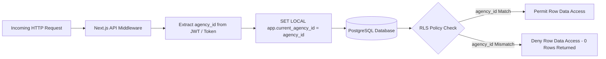
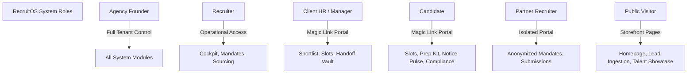
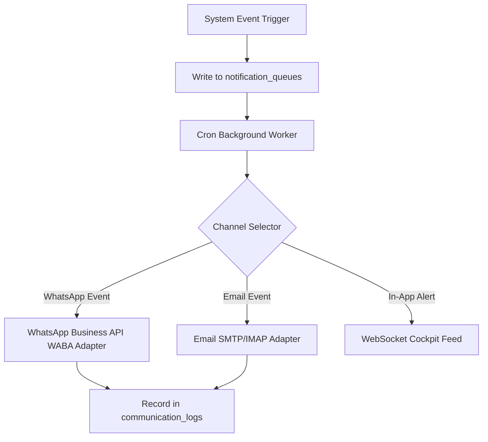
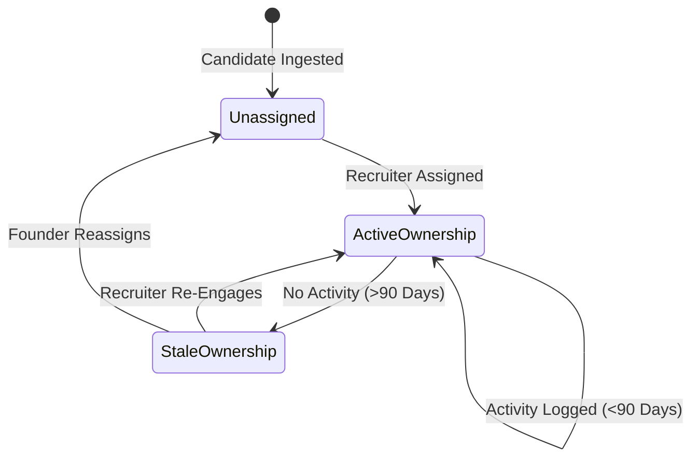
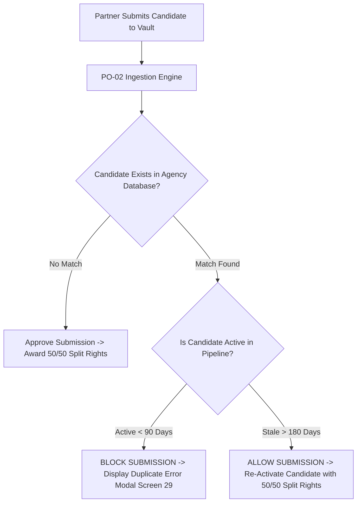
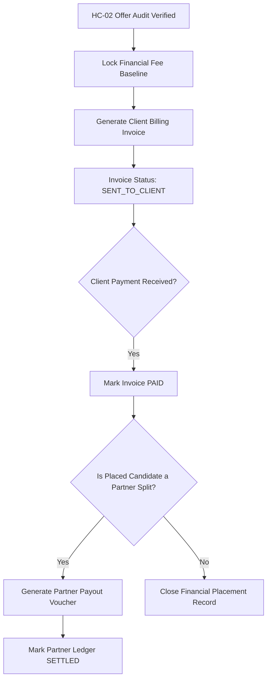
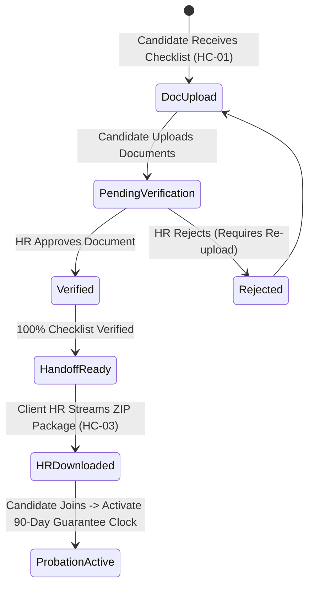
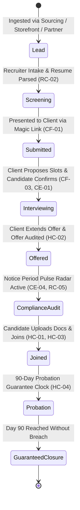
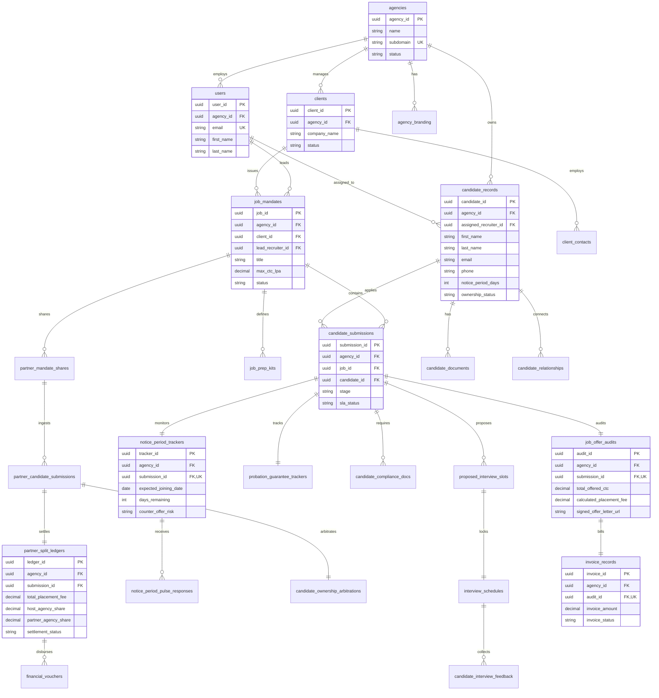

# RecruitOS - Final Database Architecture Specification

## Executive Summary & Architectural Standards

This document establishes the definitive **Database Architecture Specification** for the RecruitOS platform. Synthesizing the **Main RecruitOS PRD** (Primary Source of Truth), **V2 & V3 PRDs** (Business Rules & Edge Cases), **Stitch Design System** (UI/UX Workflows), **Product Blueprint**, and **Master Implementation Plan**, this specification forms the technical foundation prior to physical SQL or Prisma migration generation.

### Core Architectural Guarantees
1. **Multi-Tenancy Isolation**: Strictly enforced at the data layer using PostgreSQL Row-Level Security (RLS) with session-injected `agency_id` contexts.
2. **Zero-Login Security**: Secure, single-purpose time-limited access tokens for Client Shortlist Reviewers, Candidates, Client HR, and Split-Fee Partners.
3. **Data Integrity & Auditability**: Universal append-only activity feed and immutable financial audit logs.
4. **No Code Generation**: Architectural specification only (No physical SQL, Prisma, or application code in this artifact).

---

## 1. Domain-Wise Database Design

RecruitOS is partitioned into 10 logical data domains:

```mermaid
graph TD
    subgraph D1 [Identity & Access Domain]
        users --- user_roles
        users --- auth_sessions
    end

    subgraph D2 [Agency & Tenant Domain]
        agencies --- agency_branding
        agencies --- agency_job_board_credentials
    end

    subgraph D3 [Candidate Domain]
        candidate_records --- candidate_documents
        candidate_records --- candidate_relationships
        candidate_records --- candidate_ownership_logs
    end

    subgraph D4 [Recruitment Pipeline Domain]
        clients --- client_contacts
        clients --- job_mandates
        job_mandates --- candidate_submissions
        job_mandates --- job_prep_kits
        candidate_submissions --- pipeline_sla_logs
    end

    subgraph D5 [Communication & Magic Link Domain]
        communication_logs --- communication_templates
        candidate_submissions --- client_portal_tokens
    end

    subgraph D6 [Client Feedback & Interview Domain]
        candidate_submissions --- proposed_interview_slots
        proposed_interview_slots --- interview_schedules
        interview_schedules --- candidate_prep_logs
        interview_schedules --- candidate_interview_feedback
    end

    subgraph D7 [Compliance & Onboarding Domain]
        candidate_submissions --- notice_period_trackers
        notice_period_trackers --- notice_period_pulse_responses
        candidate_submissions --- candidate_compliance_docs
        candidate_submissions --- job_offer_audits
        candidate_submissions --- client_hr_handoffs
        candidate_submissions --- probation_guarantee_trackers
    end

    subgraph D8 [Partner Collaboration Domain]
        job_mandates --- partner_mandate_shares
        partner_mandate_shares --- partner_candidate_submissions
        partner_candidate_submissions --- candidate_ownership_arbitrations
        partner_candidate_submissions --- partner_split_ledgers
    end

    subgraph D9 [Finance & Billing Domain]
        job_offer_audits --- invoice_records
        invoice_records --- financial_vouchers
        invoice_records --- financial_audit_logs
    end

    subgraph D10 [Storefront & Inbound Lead Domain]
        agencies --- agency_storefront_profiles
        agency_storefront_profiles --- inbound_client_mandates
        agency_storefront_profiles --- storefront_talent_showcases
        agency_storefront_profiles --- storefront_candidate_applications
    end
```



---

## 2. Complete Table Inventory

| Table Name | Purpose | Ownership | Dependencies |
|---|---|---|---|
| `agencies` | Root multi-tenant agency record | Global Admin | None |
| `users` | Platform users (Founders, Recruiters, Client HR) | Tenant (`agencies`) | `agencies` |
| `user_roles` | User role mapping within an agency | Tenant (`agencies`) | `users`, `agencies` |
| `auth_sessions` | Active user sessions & JWT refresh tokens | System | `users` |
| `agency_branding` | White-label domain, logo, and theme configs | Tenant (`agencies`) | `agencies` |
| `agency_job_board_credentials` | Encrypted API keys for external job boards | Tenant (`agencies`) | `agencies` |
| `clients` | Enterprise client company profiles | Tenant (`agencies`) | `agencies` |
| `client_contacts` | Hiring managers & interviewers at client orgs | Tenant (`agencies`) | `clients` |
| `job_mandates` | Recruitment orders/mandates open for sourcing | Tenant (`agencies`) | `clients`, `users` |
| `job_prep_kits` | Candidate preparation guidelines & FAQs | Tenant (`agencies`) | `job_mandates` |
| `candidate_records` | Master candidate repository (Sanitized & Full) | Tenant (`agencies`) | `agencies`, `users` |
| `candidate_documents` | CV binaries, parsed JSON, and attachments | Tenant (`agencies`) | `candidate_records` |
| `candidate_relationships` | Household & relational talent mapping | Tenant (`agencies`) | `candidate_records` |
| `candidate_ownership_logs` | Recruiter ownership & reassignment logs | Tenant (`agencies`) | `candidate_records`, `users` |
| `candidate_submissions` | Candidate pipeline state for specific mandate | Tenant (`agencies`) | `job_mandates`, `candidate_records` |
| `pipeline_sla_logs` | Stage SLA aging, warning, and chase logs | Tenant (`agencies`) | `candidate_submissions` |
| `communication_logs` | 2-way WhatsApp & Email message history | Tenant (`agencies`) | `candidate_records`, `job_mandates` |
| `communication_templates` | Pre-approved WhatsApp HSM & Email templates | Tenant (`agencies`) | `agencies` |
| `client_portal_tokens` | Magic links for zero-login client review | Tenant (`agencies`) | `job_mandates`, `users` |
| `proposed_interview_slots` | Client-proposed date/time slot options | Tenant (`agencies`) | `candidate_submissions`, `client_contacts` |
| `interview_schedules` | Locked interview sessions & video room links | Tenant (`agencies`) | `proposed_interview_slots` |
| `candidate_prep_logs` | Candidate prep kit view acknowledgments | Tenant (`agencies`) | `interview_schedules` |
| `candidate_interview_feedback` | Post-interview debriefs & audio recordings | Tenant (`agencies`) | `interview_schedules` |
| `notice_period_trackers` | 90-day post-offer retention radar & drop-off risk | Tenant (`agencies`) | `candidate_submissions` |
| `notice_period_pulse_responses` | Bi-weekly pulse responses & resignation proofs | Tenant (`agencies`) | `notice_period_trackers` |
| `candidate_compliance_docs` | Candidate compliance onboarding document vault | Tenant (`agencies`) | `candidate_submissions` |
| `job_offer_audits` | Offered CTC verification & fee locks | Tenant (`agencies`) | `candidate_submissions` |
| `client_hr_handoffs` | Client HR document handoff & ZIP download logs | Tenant (`agencies`) | `candidate_submissions`, `users` |
| `probation_guarantee_trackers` | 90-day guarantee countdowns & breach alerts | Tenant (`agencies`) | `candidate_submissions` |
| `partner_mandate_shares` | Anonymized mandate shares for split-fee partners | Tenant (`agencies`) | `job_mandates` |
| `partner_candidate_submissions` | Candidate submissions from external partners | Tenant (`agencies`) | `partner_mandate_shares` |
| `candidate_ownership_arbitrations` | Duplicate submission arbitration audit logs | Tenant (`agencies`) | `partner_candidate_submissions` |
| `partner_split_ledgers` | 50/50 commission split accounting ledgers | Tenant (`agencies`) | `partner_candidate_submissions` |
| `invoice_records` | Client placement billing invoices | Tenant (`agencies`) | `job_offer_audits`, `clients` |
| `financial_vouchers` | Partner payout vouchers & settlement receipts | Tenant (`agencies`) | `partner_split_ledgers` |
| `financial_audit_logs` | Immutable accounting ledger mutation log | Tenant (`agencies`) | `invoice_records` |
| `agency_storefront_profiles` | Public web storefront agency profile | Tenant (`agencies`) | `agencies` |
| `inbound_client_mandates` | Client self-serve mandate leads from storefront | Tenant (`agencies`) | `agency_storefront_profiles` |
| `storefront_talent_showcases` | "Hot Talent" anonymized candidate teasers | Tenant (`agencies`) | `agency_storefront_profiles`, `candidate_records` |
| `storefront_candidate_applications` | Self-serve candidate portal submissions | Tenant (`agencies`) | `agency_storefront_profiles` |
| `system_activity_logs` | Universal append-only activity feed | Tenant (`agencies`) | `agencies`, `users` |
| `notification_queues` | Multi-channel dispatch queue (WhatsApp/Email) | Tenant (`agencies`) | `agencies` |
| `file_storage_records` | Cloud file registry & magic-number status | Tenant (`agencies`) | `agencies` |

---

## 3. Complete Column Definitions

Below are the detailed column specifications for primary tables across all domains.

### Domain 1: Identity & Agency Core

#### Table: `agencies`
- `agency_id` (UUID, NOT NULL, DEFAULT `gen_random_uuid()`): Primary key.
- `name` (VARCHAR(255), NOT NULL): Legal agency business name.
- `subdomain` (VARCHAR(63), NOT NULL, UNIQUE): Subdomain identifier (e.g. `apex`).
- `status` (VARCHAR(32), NOT NULL, DEFAULT `'ACTIVE'`): Status (`ACTIVE`, `SUSPENDED`).
- `subscription_tier` (VARCHAR(32), NOT NULL, DEFAULT `'ENTERPRISE'`): SaaS plan tier.
- `created_at` (TIMESTAMPTZ, NOT NULL, DEFAULT `NOW()`): Record creation timestamp.
- `updated_at` (TIMESTAMPTZ, NOT NULL, DEFAULT `NOW()`): Record last update timestamp.

#### Table: `users`
- `user_id` (UUID, NOT NULL, DEFAULT `gen_random_uuid()`): Primary key.
- `agency_id` (UUID, NOT NULL, FK `agencies.agency_id`): Tenant owner agency.
- `email` (VARCHAR(255), NOT NULL, UNIQUE): User email address.
- `password_hash` (VARCHAR(255), NOT NULL): Encrypted password hash.
- `first_name` (VARCHAR(128), NOT NULL): User given name.
- `last_name` (VARCHAR(128), NOT NULL): User family name.
- `phone` (VARCHAR(32), NULL): User contact number.
- `is_active` (BOOLEAN, NOT NULL, DEFAULT `TRUE`): Operational flag.
- `created_at` (TIMESTAMPTZ, NOT NULL, DEFAULT `NOW()`): Creation timestamp.

---

### Domain 2: Candidate & Sourcing Domain

#### Table: `candidate_records`
- `candidate_id` (UUID, NOT NULL, DEFAULT `gen_random_uuid()`): Primary key.
- `agency_id` (UUID, NOT NULL, FK `agencies.agency_id`): Tenant isolation ID.
- `assigned_recruiter_id` (UUID, NULL, FK `users.user_id`): Primary recruiter owner.
- `first_name` (VARCHAR(128), NOT NULL): Candidate first name.
- `last_name` (VARCHAR(128), NOT NULL): Candidate last name.
- `email` (VARCHAR(255), NOT NULL): Primary email address.
- `phone` (VARCHAR(32), NOT NULL): Primary phone number (E.164 format).
- `current_company` (VARCHAR(255), NULL): Current employer.
- `current_designation` (VARCHAR(255), NULL): Current job title.
- `total_experience_years` (NUMERIC(4,1), NULL): Total work experience in years.
- `notice_period_days` (INTEGER, NOT NULL, DEFAULT `60`): Official notice period days.
- `current_ctc_lpa` (NUMERIC(10,2), NULL): Current annual salary in Lakhs/Local currency.
- `expected_ctc_lpa` (NUMERIC(10,2), NULL): Expected annual salary.
- `current_location` (VARCHAR(128), NULL): Current city/country.
- `preferred_locations` (TEXT[], NULL): Array of preferred work locations.
- `primary_skills` (TEXT[], NOT NULL): Array of skill tags.
- `sanitized_summary` (TEXT, NULL): Anonymized bio for client/partner sharing.
- `source` (VARCHAR(64), NOT NULL, DEFAULT `'DIRECT_INTAKE'`): Sourcing channel (`DIRECT`, `PARTNER`, `STOREFRONT`, `SILVER_MEDALIST`).
- `ownership_status` (VARCHAR(32), NOT NULL, DEFAULT `'ACTIVE'`): Candidate ownership state (`ACTIVE`, `STALE`, `UNASSIGNED`).
- `last_activity_at` (TIMESTAMPTZ, NOT NULL, DEFAULT `NOW()`): Timestamp of last touch point.
- `created_at` (TIMESTAMPTZ, NOT NULL, DEFAULT `NOW()`): Record creation timestamp.

#### Table: `candidate_documents`
- `document_id` (UUID, NOT NULL, DEFAULT `gen_random_uuid()`): Primary key.
- `agency_id` (UUID, NOT NULL, FK `agencies.agency_id`): Tenant ID.
- `candidate_id` (UUID, NOT NULL, FK `candidate_records.candidate_id`): Parent candidate.
- `document_type` (VARCHAR(64), NOT NULL): File type (`RAW_RESUME`, `SANITIZED_RESUME`, `PORTFOLIO`).
- `file_path` (VARCHAR(512), NOT NULL): Private cloud storage bucket key.
- `file_name` (VARCHAR(255), NOT NULL): Original filename.
- `file_size_bytes` (INTEGER, NOT NULL): File size in bytes.
- `mime_type` (VARCHAR(128), NOT NULL): Verified MIME type.
- `parsed_json` (JSONB, NULL): Extracted entities from LLM/Regex parser engine.
- `created_at` (TIMESTAMPTZ, NOT NULL, DEFAULT `NOW()`): Creation timestamp.

---

### Domain 3: Recruitment Pipeline & Client Portals

#### Table: `job_mandates`
- `job_id` (UUID, NOT NULL, DEFAULT `gen_random_uuid()`): Primary key.
- `agency_id` (UUID, NOT NULL, FK `agencies.agency_id`): Tenant owner.
- `client_id` (UUID, NOT NULL, FK `clients.client_id`): Employer client.
- `lead_recruiter_id` (UUID, NOT NULL, FK `users.user_id`): Assigned lead recruiter.
- `title` (VARCHAR(255), NOT NULL): Role designation (e.g. Senior Backend Engineer).
- `headcount` (INTEGER, NOT NULL, DEFAULT `1`): Open positions.
- `min_ctc_lpa` (NUMERIC(10,2), NULL): Minimum annual budget.
- `max_ctc_lpa` (NUMERIC(10,2), NULL): Maximum annual budget.
- `location` (VARCHAR(128), NOT NULL): Work location.
- `job_description_raw` (TEXT, NOT NULL): Detailed role requirements.
- `sanitized_description` (TEXT, NULL): Anonymized JD for partner sharing.
- `fee_percentage` (NUMERIC(5,2), NOT NULL, DEFAULT `8.33`): Agreed agency fee %.
- `status` (VARCHAR(32), NOT NULL, DEFAULT `'OPEN'`): Mandate state (`OPEN`, `PAUSED`, `FILLED`, `CANCELLED`).
- `created_at` (TIMESTAMPTZ, NOT NULL, DEFAULT `NOW()`): Creation timestamp.

#### Table: `candidate_submissions`
- `submission_id` (UUID, NOT NULL, DEFAULT `gen_random_uuid()`): Primary key.
- `agency_id` (UUID, NOT NULL, FK `agencies.agency_id`): Tenant owner.
- `job_id` (UUID, NOT NULL, FK `job_mandates.job_id`): Target job mandate.
- `candidate_id` (UUID, NOT NULL, FK `candidate_records.candidate_id`): Candidate applicant.
- `stage` (VARCHAR(64), NOT NULL, DEFAULT `'SCREENED'`): Pipeline stage (`SCREENED`, `SUBMITTED_TO_CLIENT`, `INTERVIEW_SCHEDULED`, `OFFER_EXTENDED`, `COMPLIANCE_AUDIT`, `JOINED`, `REJECTED`).
- `rejection_reason` (VARCHAR(128), NULL): Structured rejection category.
- `rejection_feedback` (TEXT, NULL): Detailed client feedback notes.
- `stage_entered_at` (TIMESTAMPTZ, NOT NULL, DEFAULT `NOW()`): SLA clock start timestamp.
- `sla_status` (VARCHAR(32), NOT NULL, DEFAULT `'HEALTHY'`): SLA indicator (`HEALTHY`, `WARNING`, `BREACHED`).
- `created_at` (TIMESTAMPTZ, NOT NULL, DEFAULT `NOW()`): Submission timestamp.

---

### Domain 4: Compliance, Offer Audit & Retention Radar

#### Table: `notice_period_trackers`
- `tracker_id` (UUID, NOT NULL, DEFAULT `gen_random_uuid()`): Primary key.
- `agency_id` (UUID, NOT NULL, FK `agencies.agency_id`): Tenant owner.
- `submission_id` (UUID, NOT NULL, FK `candidate_submissions.submission_id`): Linked submission.
- `offer_accepted_date` (DATE, NOT NULL): Date offer was accepted.
- `expected_joining_date` (DATE, NOT NULL): Target joining date.
- `notice_duration_days` (INTEGER, NOT NULL): Total notice period days.
- `days_remaining` (INTEGER, NOT NULL): Real-time countdown counter.
- `resignation_proof_verified` (BOOLEAN, NOT NULL, DEFAULT `FALSE`): Verification flag.
- `counter_offer_risk` (VARCHAR(32), NOT NULL, DEFAULT `'LOW'`): Calculated risk rating (`LOW`, `MEDIUM`, `HIGH`).
- `last_pulse_response_at` (TIMESTAMPTZ, NULL): Timestamp of latest pulse response.
- `created_at` (TIMESTAMPTZ, NOT NULL, DEFAULT `NOW()`): Record creation timestamp.

#### Table: `job_offer_audits`
- `audit_id` (UUID, NOT NULL, DEFAULT `gen_random_uuid()`): Primary key.
- `agency_id` (UUID, NOT NULL, FK `agencies.agency_id`): Tenant owner.
- `submission_id` (UUID, NOT NULL, FK `candidate_submissions.submission_id`, UNIQUE): Submission.
- `offered_fixed_ctc` (NUMERIC(12,2), NOT NULL): Offered fixed annual compensation.
- `offered_variable_ctc` (NUMERIC(12,2), NOT NULL, DEFAULT `0.00`): Offered performance bonus.
- `total_offered_ctc` (NUMERIC(12,2), NOT NULL): Fixed + Variable total CTC.
- `agreed_fee_percentage` (NUMERIC(5,2), NOT NULL): Billing fee percentage.
- `calculated_placement_fee` (NUMERIC(12,2), NOT NULL): Calculated agency revenue.
- `ctc_variance_flag` (BOOLEAN, NOT NULL, DEFAULT `FALSE`): Variance flag (>10% reduction alert).
- `signed_offer_letter_url` (VARCHAR(512), NOT NULL): Private file storage link.
- `audited_by_user_id` (UUID, NOT NULL, FK `users.user_id`): Auditor recruiter/founder.
- `audited_at` (TIMESTAMPTZ, NOT NULL, DEFAULT `NOW()`): Audit timestamp.

---

### Domain 5: Partner Network & Split-Fee Ledgers

#### Table: `partner_mandate_shares`
- `share_id` (UUID, NOT NULL, DEFAULT `gen_random_uuid()`): Primary key.
- `agency_id` (UUID, NOT NULL, FK `agencies.agency_id`): Host agency owner.
- `job_id` (UUID, NOT NULL, FK `job_mandates.job_id`): Open job mandate.
- `partner_agency_name` (VARCHAR(255), NOT NULL): Partner agency identifier.
- `partner_access_token` (VARCHAR(128), NOT NULL, UNIQUE): Zero-login magic access token.
- `split_percentage` (NUMERIC(5,2), NOT NULL, DEFAULT `50.00`): Agreed commission split.
- `expires_at` (TIMESTAMPTZ, NOT NULL): Token expiration date.
- `created_at` (TIMESTAMPTZ, NOT NULL, DEFAULT `NOW()`): Share creation timestamp.

#### Table: `partner_split_ledgers`
- `ledger_id` (UUID, NOT NULL, DEFAULT `gen_random_uuid()`): Primary key.
- `agency_id` (UUID, NOT NULL, FK `agencies.agency_id`): Host agency owner.
- `submission_id` (UUID, NOT NULL, FK `candidate_submissions.submission_id`): Placed submission.
- `total_placement_fee` (NUMERIC(12,2), NOT NULL): Total placement fee collected.
- `host_agency_share` (NUMERIC(12,2), NOT NULL): Host agency 50% split earnings.
- `partner_agency_share` (NUMERIC(12,2), NOT NULL): Partner agency 50% split earnings.
- `settlement_status` (VARCHAR(32), NOT NULL, DEFAULT `'UNBILLED'`): Status (`UNBILLED`, `AWAITING_CLIENT_COLLECTION`, `READY_FOR_PAYOUT`, `SETTLED`).
- `settled_at` (TIMESTAMPTZ, NULL): Timestamp payout was released.
- `created_at` (TIMESTAMPTZ, NOT NULL, DEFAULT `NOW()`): Record creation timestamp.

---

## 4. Complete Relationship Map

### One-to-One Relationships (1:1)
- `candidate_submissions.submission_id` ↔ `job_offer_audits.submission_id` (Each placed candidate submission has exactly one official offer audit record).
- `candidate_submissions.submission_id` ↔ `notice_period_trackers.submission_id` (Each accepted candidate submission has exactly one post-offer retention radar tracker).
- `candidate_submissions.submission_id` ↔ `probation_guarantee_trackers.submission_id` (Each joined candidate submission has exactly one 90-day probation guarantee clock).
- `job_offer_audits.audit_id` ↔ `invoice_records.audit_id` (Each audited placement generates exactly one primary billing invoice).

### One-to-Many Relationships (1:N)
- `agencies.agency_id` → `users.agency_id` (One tenant agency has many operational users).
- `clients.client_id` → `job_mandates.client_id` (One client company has many hiring mandates).
- `job_mandates.job_id` → `candidate_submissions.job_id` (One mandate has many candidate submissions).
- `candidate_records.candidate_id` → `candidate_documents.candidate_id` (One candidate record has many parsed CVs and portfolios).
- `candidate_records.candidate_id` → `candidate_relationships.candidate_id` (One candidate has many network node connections).
- `notice_period_trackers.tracker_id` → `notice_period_pulse_responses.tracker_id` (One radar tracker collects bi-weekly candidate pulse check updates).
- `interview_schedules.schedule_id` → `candidate_interview_feedback.schedule_id` (One scheduled interview session collects feedback debriefs).
- `partner_split_ledgers.ledger_id` → `financial_vouchers.ledger_id` (One split-fee ledger item generates payout vouchers).

### Many-to-Many Relationships (N:M)
- `candidate_records` ↔ `job_mandates` (Intermediated via `candidate_submissions` containing stage, SLA timers, and rejection attributes).
- `job_mandates` ↔ `partner_agencies` (Intermediated via `partner_mandate_shares` containing anonymized tokens and split percentages).

---

## 5. Multi-Tenant Architecture

RecruitOS uses a **Shared-Database, Shared-Schema Tenant Isolation Strategy** powered by PostgreSQL Row-Level Security (RLS).



### Multi-Tenancy Rules
1. **Mandatory Tenant Column**: Every table (except system-wide global lookup tables) MUST contain an `agency_id UUID NOT NULL` column referencing `agencies(agency_id)`.
2. **Session Variable Injection**: Every database transaction executed by backend services must execute:
   `SET LOCAL app.current_agency_id = '<agency_id_from_jwt>';`
3. **Cross-Tenant Leakage Prevention**: Direct queries omitting `agency_id` scope will automatically filter out rows failing the RLS predicate.

---

## 6. Row-Level Security (RLS) Strategy

The following matrix specifies the data access policy per table domain:

| Table Name | Read Access | Create Access | Update Access | Delete Access |
|---|---|---|---|---|
| `agencies` | Tenant Users (`agency_id`) | Super Admin Only | Agency Founder Only | Super Admin Only |
| `users` | Same Agency Users | Agency Founder Only | Self / Founder | Agency Founder Only |
| `candidate_records` | Recruiter / Founder | Recruiter / Founder | Assigned Recruiter / Founder | Founder Only |
| `job_mandates` | Recruiter / Partner (Sanitized) | Recruiter / Founder | Lead Recruiter / Founder | Founder Only |
| `candidate_submissions` | Recruiter / Client (Magic Link) | Recruiter / Partner | Recruiter / Client HR | Founder Only |
| `job_offer_audits` | Recruiter / Founder / Client HR | Recruiter / Founder | Founder Only | Soft-Delete Only |
| `invoice_records` | Founder / Finance Admin | Founder / Finance Admin | Founder / Finance Admin | Soft-Delete Only |
| `partner_split_ledgers` | Host Agency / Partner Agency | System Service | System Service | Hard Delete Blocked |
| `communication_logs` | Recruiter / Founder | System / Recruiter | System Only | Hard Delete Blocked |

---

## 7. Role-Based Access Control (RBAC)

RecruitOS enforces 6 distinct operational roles:



### RBAC Permission Matrix

| System Module / Capability | Agency Founder | Recruiter | Client HR | Candidate | Partner Recruiter | Public Visitor |
|---|---|---|---|---|---|---|
| **Manage Agency Settings & Branding** | FULL | NONE | NONE | NONE | NONE | NONE |
| **Create & Sourcing Candidates** | FULL | FULL | NONE | NONE | SUBMIT_ONLY | NONE |
| **Manage Mandates & Assign Lead** | FULL | FULL | NONE | NONE | VIEW_MASKED | NONE |
| **Review Candidates (Zero-Login)** | FULL | FULL | READ_ONLY | NONE | NONE | NONE |
| **Confirm Interview Slot** | FULL | FULL | READ_ONLY | EXECUTE | NONE | NONE |
| **Upload Onboarding Compliance Docs** | FULL | VIEW_ONLY | VIEW_ONLY | UPLOAD_ONLY | NONE | NONE |
| **Execute Offer CTC Audit** | FULL | EXECUTE | READ_ONLY | NONE | NONE | NONE |
| **Approve Invoices & Payouts** | FULL | NONE | NONE | NONE | READ_LEDGER | NONE |
| **Submit Storefront Mandate Lead** | FULL | NONE | EXECUTE | NONE | NONE | EXECUTE |

---

## 8. Activity Feed Architecture

RecruitOS incorporates an append-only universal audit feed table (`system_activity_logs`) tracking all operational events.

### Event Taxonomy & Schema

```json
{
  "activity_id": "8f3b2a11-9c8d-4e2b-a1b2-c3d4e5f6a7b8",
  "agency_id": "e1f2a3b4-5c6d-7e8f-9a0b-1c2d3e4f5a6b",
  "actor_id": "u1a2b3c4-d5e6-7f8a-9b0c-1d2e3f4a5b6c",
  "actor_role": "RECRUITER",
  "event_type": "STAGE_CHANGED",
  "entity_type": "CANDIDATE_SUBMISSION",
  "entity_id": "s1a2b3c4-d5e6-7f8a-9b0c-1d2e3f4a5b6c",
  "metadata": {
    "previous_stage": "SCREENED",
    "new_stage": "SUBMITTED_TO_CLIENT",
    "candidate_name": "Ankit Sharma",
    "job_title": "Senior Backend Lead"
  },
  "ip_address": "192.168.1.1",
  "timestamp": "2026-08-27T10:30:00Z"
}
```

### Supported Event Types
- `candidate.created` / `candidate.updated` / `candidate.reassigned`
- `submission.stage_changed` / `submission.rejected`
- `interview.slots_proposed` / `interview.slot_confirmed`
- `notice_pulse.submitted` / `notice_risk.flagged`
- `offer.audited` / `invoice.generated` / `partner.payout_settled`

---

## 9. Notification Architecture

The platform combines an asynchronous queue worker with multi-channel dispatch adapters.



### Notification Trigger Rules
1. **Client Candidate Nudge (WhatsApp)**: Triggered when candidate batch is submitted to client portal; contains zero-login magic link.
2. **Candidate Interview Slot Selection (WhatsApp & Email)**: Triggered when client proposes interview slots; contains 1-click confirmation token link.
3. **Bi-Weekly Notice Pulse (WhatsApp)**: Triggered automatically every 14 days during post-offer 90-day window.
4. **SLA Breach Warning (Cockpit Alert)**: Triggered when candidate stays in `SUBMITTED_TO_CLIENT` stage without feedback >48 hours.

---

## 10. File Storage Architecture

Files are stored securely in Amazon S3 buckets organized by tenant and compliance domain.

### S3 Directory Taxonomy
```text
s3://recruitos-private-vault/
  ├── {agency_id}/
  │   ├── candidates/
  │   │   ├── {candidate_id}/
  │   │   │   ├── raw_resumes/
  │   │   │   └── sanitized_profiles/
  │   ├── compliance/
  │   │   ├── {submission_id}/
  │   │   │   ├── national_id/
  │   │   │   ├── relieving_letters/
  │   │   │   └── signed_offer_letters/
  │   ├── invoices/
  │   │   └── {invoice_id}.pdf
  │   └── handoffs/
  │       └── {submission_id}_compliance_package.zip
```

### File Security & Validation Rules
1. **Magic-Number Binary Validation**: Executables (`.exe`, `.sh`, `.bat`) blocked via magic-number inspection regardless of extension.
2. **Pre-Signed Short-Lived URLs**: All client/candidate download access tokens expire after 15 minutes.
3. **Automated Archival**: Files archived to S3 Glacier 365 days after placement closure.

---

## 11. Candidate Ownership Model

To prevent recruiter collision and maintain data integrity, candidate records follow explicit ownership logic.



### Candidate Ownership Rules
1. **Single Primary Recruiter**: Every active candidate is linked to exactly one `assigned_recruiter_id`.
2. **90-Day Activity Protection**: Assigned recruiters retain exclusive ownership for 90 days from last logged touchpoint (`last_activity_at`).
3. **Stale Ownership Expiration**: If no activity is logged for >90 days, candidate status shifts to `STALE`, allowing reassignment by the Agency Founder.
4. **Duplicate Candidate Arbitration**: Intake checks primary key pair `(agency_id, phone)` and `(agency_id, email)`. If match exists within 90 days, intake is rejected with existing recruiter ownership citation.

---

## 12. Partner Arbitration Model

Split-fee partner collaboration relies on automated rules to resolve ownership disputes instantly.



### Arbitration Rules
1. **First-Touch Timestamp**: Ownership determined by absolute microsecond timestamp of CV arrival in `partner_candidate_submissions`.
2. **Active Pipeline Protection (<90 Days)**: If a candidate has an active application or touchpoint within 90 days, partner submission is blocked (`submission_error_duplicate_blocked`).
3. **Stale Overwrite (>180 Days)**: If candidate record has zero activity for >180 days, partner submission overrides ownership, awarding partner 50% split commission rights.

---

## 13. Finance Architecture

The financial domain governs placement fee calculations, invoicing, collections, and partner payouts.



### Financial Business Formulas
- **Calculated Placement Fee**: $\text{Fixed CTC} \times \text{Agreed Fee \%}$
- **Host Agency Revenue Share (50/50 Split)**: $\text{Calculated Placement Fee} \times 0.50$
- **Partner Agency Commission Share**: $\text{Calculated Placement Fee} \times 0.50$

---

## 14. Compliance Architecture

Post-offer onboarding compliance manages candidate document verification, client HR handoffs, and probation guarantee tracking.



### Compliance Rules
1. **Mandatory 100% Document Verification**: Candidate cannot be moved to `JOINED` status until all required checklist items are marked `VERIFIED`.
2. **Zero-Touch ZIP Streaming**: Documents streamed directly to Client HR via single-use, 15-minute expiring magic link package.
3. **90-Day Probation Guarantee Clock**: Daily cron job decrements `days_remaining` in `probation_guarantee_trackers`. If candidate quits within 90 days, system flags breach and auto-generates replacement job mandate.

---

## 15. Candidate Lifecycle Model

The unified candidate lifecycle spans 8 discrete states from initial lead ingestion to guaranteed placement closure.



---

## 16. Final Mermaid Entity Relationship Diagram (ERD)

Below is the complete database ERD visual specification spanning all 10 platform domains.


