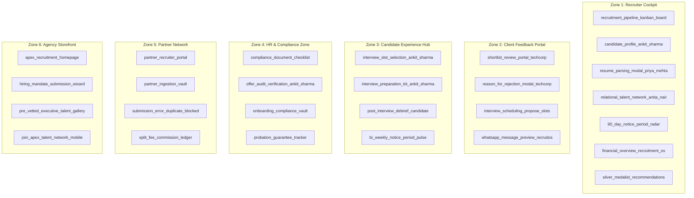
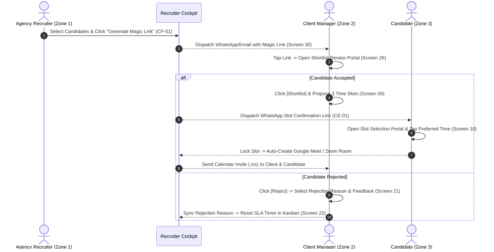
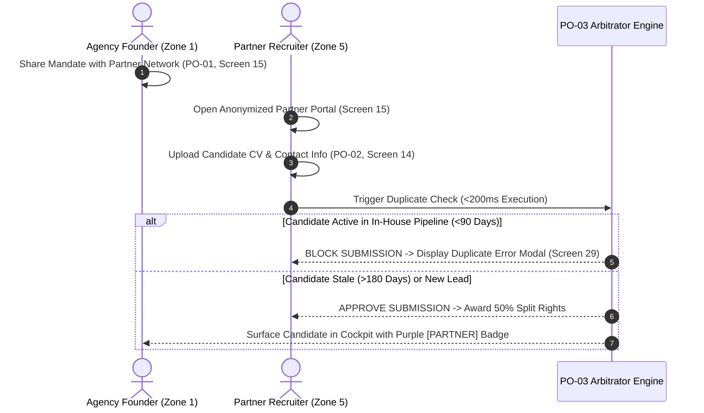

# RecruitOS - System Design Specification & Product Blueprint

## Executive Summary & Design System Integration

This System Design Specification establishes the unified product blueprint for **RecruitOS**, harmonizing the functional requirements of the Product Requirement Document (PRD) with the **Stitch "Precision Enterprise" Design System**.

RecruitOS transitions traditional agency recruitment from a static candidate data repository to an active, SLA-driven operational command center. Built around multi-channel communication (WhatsApp Business API & Email), zero-login magic link portals, automated notice-period retention radar, and split-fee partner collaboration, the platform provides seamless experiences across 6 operational zones.

---

## 1. Design System Tokens & Aesthetics (Stitch "Precision Enterprise")

The UI adheres strictly to the Stitch *Precision Enterprise* design token specification:
- **Primary Surface**: `#F8F9FF` (Soft Porcelain blue-gray tint)
- **Container Surfaces**: `#FFFFFF` (Base cards), `#EFF4FF` (Low elevation), `#E5EEFF` (Active container)
- **Brand Accents**: Deep Navy `#0F172A` (Primary text & enterprise headers), Electric Cobalt `#2563EB` (Primary CTAs), Warm Yellow `#FFD400` (Highlight badges & secondary CTAs)
- **SLA Alert System**: Amber `#F59E0B` (SLA Warning at 48h), Crimson `#EF4444` (SLA Breach at 72h / High Drop-off Risk)
- **Typography**: Inter / Outfit sans-serif hierarchy with crisp letter-spacing and numeric alignment.

---

## 2. Screen-by-Screen System Specification

Every screen in the Stitch design library is mapped below to its parent PRD feature, zone, UI layout, user actions, backend microservices, database entities, and API endpoints.

---

### Zone 1: Recruiter Cockpit (Command Center & SLA Radar)

#### Screen 01: `90_day_notice_period_radar_vikram_malhotra`
- **PRD Feature**: RC-05 (Post-Offer 90-Day Drop-Off Radar)
- **Zone**: Zone 1 (Recruiter Cockpit)
- **UI Components**: Candidate Profile Header, Notice Period Timeline Bar (Day 15/60), Risk Badge (`HIGH RISK` - Crimson Glow), Transition Document Checklist, Communication Feed Drawer, Emergency Call Button, Radar Filter Controls.
- **User Actions**: Click "Launch Emergency Call Log", View Candidate Resignation Proof, Filter Candidate Drop-Off Radar, Export Radar PDF/CSV.
- **Backend Services**: Notice Period Monitoring Service, Risk Analytics Worker, WhatsApp Communication Service.
- **Database Entities**: `notice_period_trackers`, `notice_period_pulse_responses`, `candidate_records`, `candidate_submissions`.
- **API Endpoints**:
  - `GET /api/v1/cockpit/notice-radar`
  - `POST /api/v1/notice-period/:id/trigger-call`

#### Screen 04 & 23: `candidate_profile_ankit_sharma` / `recruitpro_enterprise_hrms_flow`
- **PRD Feature**: RC-01 (Unified WhatsApp & Email Communication Log)
- **Zone**: Zone 1 (Recruiter Cockpit)
- **UI Components**: Candidate Profile Card, Stage Dropdown Header, Section Tabs (Scorecard, Experience, Application Data, Live Communication Feed), WhatsApp & Email Drawer, Quick Template Picker, Resume Download CTA.
- **User Actions**: Send 2-Way WhatsApp/Email Message, Select Quick Response Template, Change Candidate Pipeline Stage, Download Raw Resume PDF, Schedule Meeting.
- **Backend Services**: Candidate Management Service, Unified Messaging Worker (WABA/SMTP), Scorecard Service.
- **Database Entities**: `candidate_records`, `communication_logs`, `candidate_submissions`, `job_mandates`.
- **API Endpoints**:
  - `GET /api/v1/candidates/:id`
  - `POST /api/v1/cockpit/communications/send`
  - `PATCH /api/v1/submissions/:id/stage`

#### Screen 06: `financial_overview_recruitment_os`
- **PRD Feature**: RC-06 (Lifecycle-Triggered Settlement & Invoicing Engine)
- **Zone**: Zone 1 (Recruiter Cockpit)
- **UI Components**: Summary Metrics Cards (Unbilled Placements, Overdue Invoices, Active Guarantee Windows), Active Placement Table, Invoice Approval Drawer, Quarterly Financial Projection Chart.
- **User Actions**: Approve & Dispatch Invoice to Client Finance, Add Manual Placement Record, Export Financial Report, Filter Account Invoices.
- **Backend Services**: Billing & Settlement Service, Accounting Integration Worker, Email Dispatcher.
- **Database Entities**: `invoice_records`, `job_offer_audits`, `candidate_submissions`, `agencies`.
- **API Endpoints**:
  - `GET /api/v1/financials/invoices`
  - `POST /api/v1/financials/invoices/:id/approve-dispatch`

#### Screen 22: `recruitment_pipeline_kanban_board`
- **PRD Feature**: RC-03 (Pipeline SLA & Stagnation Aging Radar)
- **Zone**: Zone 1 (Recruiter Cockpit)
- **UI Components**: Kanban Columns (Screened, Submitted, Interview Scheduled, Offer Extended, Joined), Candidate Cards with SLA Aging Timers (Yellow Alert / Red Breach), 1-Click Client Chase Button, Pipeline Filter Bar.
- **User Actions**: Drag & Drop Candidate Cards across Stages, Click "Send Auto Nudge", Filter Stalled Pipeline Mandates.
- **Backend Services**: Pipeline SLA Radar Engine, Automated Client Chase Worker.
- **Database Entities**: `candidate_submissions`, `job_mandates`, `pipeline_sla_logs`.
- **API Endpoints**:
  - `GET /api/v1/cockpit/sla-radar`
  - `POST /api/v1/submissions/:id/chase-client`

#### Screen 24: `relational_talent_network_anita_nair`
- **PRD Feature**: RC-04 (Relational Talent & Household Mapping)
- **Zone**: Zone 1 (Recruiter Cockpit)
- **UI Components**: Interactive Household & Relationship Graph Visualizer, Candidate Detail Drawer, Connection Nodes (Spouse, Ex-Colleague, Referral), Target Location Auto-Update Badge, Mandate Assignment CTA Button.
- **User Actions**: Explore Network Graph Nodes, Relocate Candidate Target Location, Assign Connected Candidate to Open Mandate.
- **Backend Services**: Relational Graph GraphDB/SQL Service, Opportunity Matching Worker.
- **Database Entities**: `candidate_relationships`, `candidate_records`, `job_mandates`.
- **API Endpoints**:
  - `POST /api/v1/candidates/relationships`
  - `GET /api/v1/candidates/:id/network`

#### Screen 25: `resume_parsing_modal_priya_mehta`
- **PRD Feature**: RC-02 (Automated Intake & Clean CV Parsing Engine)
- **Zone**: Zone 1 (Recruiter Cockpit)
- **UI Components**: Modal Overlay, Raw CV Document Viewer, Entity Extraction Form (Parsed Name, Skills, Experience, Notice Period, CTC), Duplicate Match Alert Banner, Sanitized Client-Ready Profile Toggle.
- **User Actions**: Edit Parsed Fields, Resolve Duplicate Candidate Match, Toggle Sanitized View, Confirm & Save Candidate Record.
- **Backend Services**: LLM/Regex CV Parsing Service, S3 Binary Storage Engine, Duplicate Arbitration Engine.
- **Database Entities**: `candidate_records`, `candidate_documents`.
- **API Endpoints**:
  - `POST /api/v1/candidates/parse-cv`
  - `POST /api/v1/candidates/confirm-intake`
  - `GET /api/v1/candidates/:id/sanitized`

#### Screen 27: `silver_medalist_recommendations_deepak_roy`
- **PRD Feature**: RC-07 (Talent Database Recycling Engine - "Silver Medalist" Indexer)
- **Zone**: Zone 1 (Recruiter Cockpit)
- **UI Components**: Job Mandate Creation Step, Silver Medalist Carousel Overlay, Historical Candidate Cards, Previous Interview Stage & Score Cards, 1-Click WhatsApp Re-Engagement Button.
- **User Actions**: Review Matching Historical Silver Medalists, Trigger 1-Click WhatsApp Re-Engagement Ping, Import Candidate to Mandate.
- **Backend Services**: Historical Candidate Matching Engine, WABA Outreach Worker.
- **Database Entities**: `candidate_records`, `candidate_submissions`, `job_mandates`.
- **API Endpoints**:
  - `GET /api/v1/jobs/:id/silver-medalists`
  - `POST /api/v1/candidates/re-engage`

---

### Zone 2: Client & Interviewer Portal (The Feedback Engine)

#### Screen 26: `shortlist_review_portal_techcorp`
- **PRD Feature**: CF-01 (Zero-Login Magic Link Candidate Presenter)
- **Zone**: Zone 2 (Client & Interviewer Portal)
- **UI Components**: Zero-Login Header (Client Branding & Mandate Title), Candidate Summary Cards, Sanitized Profile Viewer (No Phone/Email), 1-Click Action Buttons (`[Shortlist]`, `[Reject]`, `[Hold]`), Export Selected Profiles CTA.
- **User Actions**: Review Sanitized Candidate Profiles, Click Decision Buttons, Request Interview Scheduling, Download Portfolio.
- **Backend Services**: Portal Token Service, Client Feedback Worker, Security Audit Logger.
- **Database Entities**: `client_portal_tokens`, `job_mandates`, `candidate_submissions`, `candidate_records`.
- **API Endpoints**:
  - `GET /api/v1/public/portal/:token`
  - `POST /api/v1/jobs/:id/generate-client-link`

#### Screen 21: `reason_for_rejection_modal_techcorp`
- **PRD Feature**: CF-02 (One-Click Candidate Decision & Feedback Matrix)
- **Zone**: Zone 2 (Client & Interviewer Portal)
- **UI Components**: Modal Overlay, Structured Rejection Reason Radio Group (`Over Budget`, `Technical Skill Gap`, `Notice Period`, `Culture Fit`, `Other`), Feedback Notes Textarea, Submit Rejection CTA.
- **User Actions**: Select Structured Rejection Reason, Input Detailed Feedback Notes, Confirm Rejection.
- **Backend Services**: Client Feedback Processing Engine, Cockpit SLA Reset Worker.
- **Database Entities**: `candidate_submissions`, `client_portal_tokens`.
- **API Endpoints**:
  - `POST /api/v1/public/portal/:token/submissions/:submission_id/decision`

#### Screen 09: `interview_scheduling_propose_slots`
- **PRD Feature**: CF-03 (Asynchronous Interview Slot Selector)
- **Zone**: Zone 2 (Client & Interviewer Portal)
- **UI Components**: 7-Day Interactive Calendar Grid, Time Slot Multi-Select Buttons, Interviewer Email Input Field, Proposals Summary Card, Send Slot Proposals CTA.
- **User Actions**: Click Preferred Date & Time Slots, Add Interviewer Email Address, Dispatch Proposals to Candidate.
- **Backend Services**: Scheduling Coordination Engine, Candidate WhatsApp Dispatcher.
- **Database Entities**: `proposed_interview_slots`, `candidate_submissions`, `client_portal_tokens`.
- **API Endpoints**:
  - `POST /api/v1/public/portal/:token/submissions/:submission_id/slots`

#### Screen 30: `whatsapp_message_preview_recruitos`
- **PRD Feature**: RC-01 / CF-01 (Out-of-App Mobile Nudge & WhatsApp Magic Link Preview)
- **Zone**: Zone 1 & Zone 2 Interlink
- **UI Components**: WhatsApp Business Interface Shell, Verified Agency Badge, Message Body, Dynamic Magic Link Button ("Review Candidates Now").
- **User Actions**: Tap Magic Link Button on WhatsApp.
- **Backend Services**: WhatsApp Business API (WABA) Gateway, Token Authenticator.
- **Database Entities**: `communication_logs`, `client_portal_tokens`.
- **API Endpoints**:
  - `POST /api/v1/cockpit/communications/send`
  - `POST /api/v1/webhooks/whatsapp`

---

### Zone 3: Candidate Experience Hub (Engagement Loop & Prep)

#### Screen 10: `interview_slot_selection_ankit_sharma`
- **PRD Feature**: CE-01 (1-Click WhatsApp Slot Confirmator)
- **Zone**: Zone 3 (Candidate Experience Hub)
- **UI Components**: Candidate Mobile View, Mandate & Round Title Header, Timezone-Converted Proposed Slot Radio Cards, Confirm Slot CTA Button.
- **User Actions**: Select 1 Preferred Time Slot, Tap "Confirm Interview Slot", Download Calendar (.ics).
- **Backend Services**: Scheduling Lock Service, Video Room Generator (Google Meet/Zoom), Calendar (.ics) Generator.
- **Database Entities**: `interview_schedules`, `proposed_interview_slots`, `candidate_submissions`.
- **API Endpoints**:
  - `GET /api/v1/public/candidate/slots/:token`
  - `POST /api/v1/public/candidate/confirm-slot`

#### Screen 08: `interview_preparation_kit_ankit_sharma`
- **PRD Feature**: CE-02 (Automated "Interview Prep Kit" Trigger)
- **Zone**: Zone 3 (Candidate Experience Hub)
- **UI Components**: Mobile Page Header, Countdown Timer ("Interview in 18 Hours"), Accordion Sections (1. Company Overview, 2. Behavioral Questions & Frameworks, 3. Interviewer Profile), Acknowledgment CTA ("I Have Reviewed & I Am Ready").
- **User Actions**: Read Company & Tech Stack Insights, Study Behavioral Frameworks, Tap "I Have Reviewed & I Am Ready".
- **Backend Services**: Prep Kit Delivery Engine, Candidate Engagement Tracker.
- **Database Entities**: `job_prep_kits`, `candidate_prep_logs`, `interview_schedules`.
- **API Endpoints**:
  - `GET /api/v1/public/candidate/prep-kit/:token`
  - `POST /api/v1/public/candidate/prep-kit/:token/acknowledge`

#### Screen 16: `post_interview_debrief_candidate_feedback`
- **PRD Feature**: CE-03 (Post-Interview Candidate Feedback Collector)
- **Zone**: Zone 3 (Candidate Experience Hub)
- **UI Components**: Mobile Debrief Form, 1-5 Star Rating Picker, Sentiment Selector (`Excited`, `Doubts`, `Not Interested`), Text Notes Input, Voice Note Audio Recording Widget, Submit Debrief CTA.
- **User Actions**: Tap Star Rating, Select Sentiment Option, Record 30-Sec Audio Debrief, Type Notes, Submit Feedback.
- **Backend Services**: Candidate Feedback Engine, Voice File S3 Ingestion Worker.
- **Database Entities**: `candidate_interview_feedback`, `interview_schedules`, `candidate_submissions`.
- **API Endpoints**:
  - `POST /api/v1/public/candidate/interview-feedback`
  - `POST /api/v1/public/candidate/upload-voice-debrief`

#### Screen 03: `bi_weekly_notice_period_pulse`
- **PRD Feature**: CE-04 (Passive Notice-Period Pulse Check)
- **Zone**: Zone 3 (Candidate Experience Hub)
- **UI Components**: Mobile Portal Header, Notice Progress Bar (Day 15/60), Radio Options (Counter-Offer Status), Resignation Acceptance Upload Dropzone, Submit Update CTA.
- **User Actions**: Answer Counter-Offer Radio Question, Drop Resignation Acceptance Proof File, Submit Bi-Weekly Update.
- **Backend Services**: Notice Period Tracker Service, Cloud Storage (S3) Engine, Drop-Off Risk Analyzer.
- **Database Entities**: `notice_period_pulse_responses`, `notice_period_trackers`, `candidate_records`.
- **API Endpoints**:
  - `POST /api/v1/public/candidate/notice-pulse`
  - `POST /api/v1/public/candidate/upload-resignation-proof`

---

### Zone 4: HR & Compliance Zone (Post-Offer Handoff)

#### Screen 05: `compliance_document_checklist_techcorp_onboarding`
- **PRD Feature**: HC-01 (Automated Compliance Document Vault)
- **Zone**: Zone 4 (HR & Compliance Zone)
- **UI Components**: Candidate Mobile Header, Overall Upload Progress Bar, Document Item Cards (National ID, Relieving Letter, Payslips, Signed Offer), Document Upload Status Badges, Upload PDF CTA Buttons.
- **User Actions**: Select Document File from Mobile/Desktop, Upload File, Track Document Verification Progress.
- **Backend Services**: Compliance Document Vault Service, Document Type & Virus Validation Engine, Private S3 Storage Service.
- **Database Entities**: `candidate_compliance_docs`, `candidate_submissions`, `candidate_records`.
- **API Endpoints**:
  - `GET /api/v1/public/candidate/compliance-status/:token`
  - `POST /api/v1/public/candidate/compliance-doc`
  - `POST /api/v1/hr/reject-doc`

#### Screen 12: `offer_audit_verification_ankit_sharma`
- **PRD Feature**: HC-02 (Offer Audit & CTC Verification Engine)
- **Zone**: Zone 4 (HR & Compliance Zone)
- **UI Components**: Form Drawer, Offered Financials Section (Fixed CTC, Variable CTC, Joining Date), Placement Fee Calculation Card, CTC Variance Warning Banner (>10% drop alert), View Offer Letter Button, Confirm & Save Audit CTA.
- **User Actions**: Input Offered Financial Terms, Upload Signed Offer Letter, Confirm Offer Audit.
- **Backend Services**: Offer Audit Engine, Fee Calculator Service, Invoicing Pre-Processor.
- **Database Entities**: `job_offer_audits`, `candidate_submissions`, `offer_audit_logs`, `invoice_records`.
- **API Endpoints**:
  - `POST /api/v1/offers/audit`
  - `GET /api/v1/offers/audit/:submission_id`

#### Screen 13: `onboarding_compliance_vault_ankit_sharma`
- **PRD Feature**: HC-03 (Zero-Touch Client HR Handoff Portal)
- **Zone**: Zone 4 (HR & Compliance Zone)
- **UI Components**: Desktop Vault View, Verification Summary Bar (100% Verified), Document Table with Direct Preview Links, Audit Trail Timeline, Stream ZIP Package CTA, "Confirm Candidate Joined Successfully" CTA.
- **User Actions**: Preview Candidate Compliance Documents, Stream 1-Click ZIP Archive, Confirm Candidate Joining.
- **Backend Services**: HR Handoff Service, ZIP Streaming Engine, Billing & Probation Activation Trigger.
- **Database Entities**: `client_hr_handoffs`, `candidate_submissions`, `candidate_compliance_docs`.
- **API Endpoints**:
  - `GET /api/v1/public/hr-portal/:token/download-zip`
  - `POST /api/v1/public/hr-portal/:token/confirm-joining`

#### Screen 19 & 20: `probation_guarantee_tracker_ankit_sharma_1` / `_2`
- **PRD Feature**: HC-04 (Probation Guarantee Clock & Milestone Tracker)
- **Zone**: Zone 4 (HR & Compliance Zone)
- **UI Components**: Probation Timeline Counter (Day 1 to Day 90), Financial Revenue at Risk Card, Scheduled Milestone Checkpoints (Day 30, Day 60, Day 80), Log Candidate Check-in CTA, Activity Timeline.
- **User Actions**: Log Check-in Debrief, Record Probation Breach / Resignation, Export Probation Report.
- **Backend Services**: Probation Monitoring Engine, Daily Cron Progress Worker, Replacement Mandate Generator.
- **Database Entities**: `probation_guarantee_trackers`, `candidate_submissions`, `job_mandates`.
- **API Endpoints**:
  - `POST /api/v1/probation/breach`
  - `POST /api/v1/probation/milestone-check`

---

### Zone 5: Partner & Vendor Collaboration Network (Split-Fee Management)

#### Screen 15: `partner_recruiter_portal_dubai_e_commerce_mandate`
- **PRD Feature**: PO-01 (Anonymized Mandate Sharing & Client Masking Vault)
- **Zone**: Zone 5 (Partner Collaboration Network)
- **UI Components**: Masked Mandate Header ("Leading Tier-1 E-Commerce Platform"), Split Fee Badge (50/50), Sanitized Job Description Section, Key Skills Required Tags, Submit Candidate CTA.
- **User Actions**: Review Masked Mandate Specs, Read Sanitized Agreement Terms, Click Submit Candidate.
- **Backend Services**: Mandate Anonymization Service, Partner Access Control Service.
- **Database Entities**: `partner_mandate_shares`, `job_mandates`, `agencies`.
- **API Endpoints**:
  - `GET /api/v1/public/partner/:token`
  - `POST /api/v1/jobs/:job_id/partner-share`

#### Screen 14: `partner_ingestion_vault_shared_mandate_842`
- **PRD Feature**: PO-02 (Isolated Partner Submission Vault)
- **Zone**: Zone 5 (Partner Collaboration Network)
- **UI Components**: Dedicated Partner Portal Layout, Mandate Summary Card, Candidate Submission Form (Name, Email, Phone, Notice Period, CTC, CV Upload Dropzone), Partner's Submitted Candidates Status Table.
- **User Actions**: Input Candidate Details, Drop CV File, Click "Submit Candidate to Vault", Track Submission Stage.
- **Backend Services**: Partner Ingestion Engine, Duplicate Arbitrator Engine (<200ms check).
- **Database Entities**: `partner_candidate_submissions`, `candidate_submissions`, `candidate_records`.
- **API Endpoints**:
  - `POST /api/v1/public/partner/:token/submissions`
  - `GET /api/v1/public/partner/:token/my-submissions`

#### Screen 29: `submission_error_duplicate_blocked`
- **PRD Feature**: PO-03 (Automated Candidate Ownership & Duplicate Arbitrator)
- **Zone**: Zone 5 (Partner Collaboration Network)
- **UI Components**: Modal Overlay, Warning/Error Badge, Arbitration Audit Details ("Active Client Pipeline - Blocked"), First-Touch Ownership Timestamp, Rules Expiration Counter, Acknowledge CTA Button.
- **User Actions**: Read Duplicate Arbitration Details, Click Acknowledge.
- **Backend Services**: Duplicate Arbitrator Engine (<200ms execution), Audit Logger.
- **Database Entities**: `candidate_ownership_arbitrations`, `candidate_submissions`, `candidate_records`.
- **API Endpoints**:
  - Internal Service: `arbitrateCandidateOwnership`
  - `GET /api/v1/partner/arbitration-log/:job_id`

#### Screen 28: `split_fee_commission_ledger_partner_portal`
- **PRD Feature**: PO-04 (Split-Fee Ledger & Auto-Settlement Interlink)
- **Zone**: Zone 5 (Partner Collaboration Network)
- **UI Components**: Partner Financial Metrics Cards (Total Earned, Pending Collections, Ready for Payout), Split-Fee Transaction Table (Mandate, Candidate Name, Total Placement Fee, Partner Split %, Payment Status), Request Payout Voucher CTA.
- **User Actions**: Filter Financial Transactions, Download Commission Statement CSV, Request Payout Settlement.
- **Backend Services**: Partner Settlement Engine, Financial Voucher Generator.
- **Database Entities**: `partner_split_ledgers`, `partner_mandate_shares`, `candidate_submissions`.
- **API Endpoints**:
  - `GET /api/v1/public/partner/:token/ledger`
  - `POST /api/v1/financials/partner-payout/:ledger_id/mark-paid`

---

### Zone 6: Agency Storefront (Inbound Lead Generation)

#### Screen 02: `apex_recruitment_partners_homepage`
- **PRD Feature**: AS-01 (Public Agency Storefront & Branded Engine)
- **Zone**: Zone 6 (Agency Storefront)
- **UI Components**: Top Navigation Header (Logo, Sector Practices, Markets, "Submit Hiring Requirement" CTA), Hero Banner, Key Performance Metrics Bar (140+ Placements, 72h SLA, 98% Retention), Sector Grid Cards, Founder Bio, Footer.
- **User Actions**: Click "Submit Hiring Requirement", Click "Hire Talent", Browse Sector Expertise, Click Client Login.
- **Backend Services**: Storefront Dynamic Profile Engine, Metric Aggregator Service.
- **Database Entities**: `agency_storefront_profiles`, `agencies`, `job_mandates`.
- **API Endpoints**:
  - `GET /api/v1/public/storefront/:subdomain`
  - `PUT /api/v1/agency/storefront-settings`

#### Screen 07: `hiring_mandate_submission_wizard_role_specs`
- **PRD Feature**: AS-02 (Self-Serve Client Mandate Ingestion Engine)
- **Zone**: Zone 6 (Agency Storefront)
- **UI Components**: 4-Step Intake Wizard Progress Bar, Role Specification Form (Job Title, Target CTC Range Slider, Location, Skill Tags, JD Text Box), Terms Selection Radios (Contingency vs Priority Retainer), Submit Mandate CTA.
- **User Actions**: Complete Multi-Step Form, Drag CTC Range Slider, Select Term Type, Upload Internal JD, Submit Hiring Mandate.
- **Backend Services**: Client Mandate Ingestion Engine, Cockpit Intake Alert Trigger, reCAPTCHA Service.
- **Database Entities**: `inbound_client_mandates`, `job_mandates`, `clients`.
- **API Endpoints**:
  - `POST /api/v1/public/storefront/:subdomain/submit-mandate`

#### Screen 17: `pre_vetted_executive_talent_gallery`
- **PRD Feature**: AS-03 ("Hot Talent Showcase" & Candidate Teaser Gallery)
- **Zone**: Zone 6 (Agency Storefront)
- **UI Components**: Gallery Header, Anonymized Candidate Teaser Cards (Sanitized Title, Experience Years, Notice Period, Skill Tags, Summary Snippet), "Request Full Candidate Profile" CTA Button, Employer Lead In-Line Modal.
- **User Actions**: Browse Teaser Gallery, Click "Request Profile", Submit Employer Email & Company Name.
- **Backend Services**: Talent Showcase Delivery Engine, Lead Ingestion Worker.
- **Database Entities**: `storefront_talent_showcases`, `candidate_records`, `inbound_client_mandates`.
- **API Endpoints**:
  - `GET /api/v1/public/storefront/:subdomain/talent`
  - `POST /api/v1/public/storefront/:subdomain/request-talent`

#### Screen 11: `join_apex_talent_network_mobile_submission`
- **PRD Feature**: AS-04 (Candidate Self-Serve Application Portal)
- **Zone**: Zone 6 (Agency Storefront)
- **UI Components**: Mobile Modal View, Input Fields (Full Name, Email, Phone, Desired Role, Notice Period), Drag & Drop Resume Upload Box, Submit Application CTA.
- **User Actions**: Fill Personal & Professional Details, Drop CV File (PDF/DOCX), Submit Direct Application.
- **Backend Services**: Application Processing Service, Auto CV Parser (RC-02 engine), Malware Virus Scanner.
- **Database Entities**: `storefront_candidate_applications`, `candidate_records`, `candidate_documents`.
- **API Endpoints**:
  - `POST /api/v1/public/storefront/:subdomain/apply`

---

## 3. Screen Inventory & Structural Matrix

| # | Screen Directory / File | Zone | Core PRD Feature | Access Role | Primary Layout Type |
|---|---|---|---|---|---|
| 01 | `90_day_notice_period_radar_vikram_malhotra` | Zone 1 | RC-05 | Recruiter / Founder | Dashboard Drawer View |
| 02 | `apex_recruitment_partners_homepage` | Zone 6 | AS-01 | Public / Client | Public Web Page |
| 03 | `bi_weekly_notice_period_pulse` | Zone 3 | CE-04 | Candidate | Mobile Zero-Login Page |
| 04 | `candidate_profile_ankit_sharma` | Zone 1 | RC-01 | Recruiter | Workspace Tabbed Drawer |
| 05 | `compliance_document_checklist_techcorp_onboarding` | Zone 4 | HC-01 | Candidate / Client HR | Mobile Checklist Page |
| 06 | `financial_overview_recruitment_os` | Zone 1 | RC-06 | Recruiter / Founder | Dashboard Financial Table |
| 07 | `hiring_mandate_submission_wizard_role_specs` | Zone 6 | AS-02 | Client / Founder | Multi-Step Wizard Page |
| 08 | `interview_preparation_kit_ankit_sharma` | Zone 3 | CE-02 | Candidate | Mobile Accordion Kit |
| 09 | `interview_scheduling_propose_slots` | Zone 2 | CF-03 | Client Manager | Calendar Modal Grid |
| 10 | `interview_slot_selection_ankit_sharma` | Zone 3 | CE-01 | Candidate | Mobile Slot Selection Page |
| 11 | `join_apex_talent_network_mobile_submission` | Zone 6 | AS-04 | Candidate / Public | Mobile Modal Form |
| 12 | `offer_audit_verification_ankit_sharma` | Zone 4 | HC-02 | Recruiter / HR | Audit Form Drawer |
| 13 | `onboarding_compliance_vault_ankit_sharma` | Zone 4 | HC-03 | Client HR | Verification Portal Table |
| 14 | `partner_ingestion_vault_shared_mandate_842` | Zone 5 | PO-02 | Partner Recruiter | Restricted Portal Workspace |
| 15 | `partner_recruiter_portal_dubai_e_commerce_mandate` | Zone 5 | PO-01 | Partner Recruiter | Anonymized Portal Page |
| 16 | `post_interview_debrief_candidate_feedback` | Zone 3 | CE-03 | Candidate | Mobile Debrief & Audio Form |
| 17 | `pre_vetted_executive_talent_gallery` | Zone 6 | AS-03 | Public / Client | Public Gallery Grid |
| 18 | `precision_enterprise` | N/A | Design System | System Admin | Design Token Specs (`DESIGN.md`) |
| 19 | `probation_guarantee_tracker_ankit_sharma_1` | Zone 4 | HC-04 | Recruiter / Founder | Progress Counter View |
| 20 | `probation_guarantee_tracker_ankit_sharma_2` | Zone 4 | HC-04 | Recruiter / Founder | Activity & Risk Feed View |
| 21 | `reason_for_rejection_modal_techcorp` | Zone 2 | CF-02 | Client Manager | Modal Overlay Form |
| 22 | `recruitment_pipeline_kanban_board` | Zone 1 | RC-03 | Recruiter / Founder | Kanban Board View |
| 23 | `recruitpro_enterprise_hrms_flow` | Zone 1 | RC-01 | Recruiter | Scorecard & Feed Drawer |
| 24 | `relational_talent_network_anita_nair` | Zone 1 | RC-04 | Recruiter / Founder | Network Node Graph |
| 25 | `resume_parsing_modal_priya_mehta` | Zone 1 | RC-02 | Recruiter | Parsing & Duplicate Modal |
| 26 | `shortlist_review_portal_techcorp` | Zone 2 | CF-01 | Client Manager | Zero-Login List View |
| 27 | `silver_medalist_recommendations_deepak_roy` | Zone 1 | RC-07 | Recruiter | Matching Recommendations Drawer |
| 28 | `split_fee_commission_ledger_partner_portal` | Zone 5 | PO-04 | Partner Recruiter | Commission Ledger Table |
| 29 | `submission_error_duplicate_blocked` | Zone 5 | PO-03 | Partner Recruiter | Arbitration Error Modal |
| 30 | `whatsapp_message_preview_recruitos` | Zone 1/2 | RC-01/CF-01 | All Roles | Mobile WhatsApp Chat Shell |

---

## 4. Role-Wise Access Matrix

| Operational Zone & Module | Agency Founder | Client Manager | Candidate | Client HR | Partner Recruiter | Public Visitor |
|---|---|---|---|---|---|---|
| **Recruiter Cockpit (Zone 1)** | Full Control | No Access | No Access | No Access | No Access | No Access |
| **Client Portal (Zone 2)** | View & Manage | Magic Link Access | No Access | View Only | No Access | No Access |
| **Candidate Hub (Zone 3)** | View Logs | No Access | Magic Link Access | No Access | No Access | No Access |
| **HR & Compliance (Zone 4)** | Full Control | No Access | Upload Only | Magic Link Access | No Access | No Access |
| **Partner Network (Zone 5)** | Manage Splits | No Access | No Access | No Access | Magic Link Access | No Access |
| **Agency Storefront (Zone 6)** | Admin Config | Submit Orders | Submit CV | No Access | No Access | Public Access |

---

## 5. End-to-End User Journeys

### Journey 1: Client Zero-Login Review & Interview Scheduling

### Journey 2: Partner Anonymized Submission & Duplicate Arbitration

---

## 6. Gap Analysis & Product Alignment Blueprint

### 1. Missing Screens in Stitch (Required in PRD)
- **RC-08 Job Board Multi-Broadcast & Webhook Dashboard**: Interface for entering encrypted API keys for Naukri, Bayt, and LinkedIn Jobs, plus broadcast status feeds.
- **CF-04 Client SLA Chase Escalation Log**: Audit screen listing historical automated WhatsApp/email nudges sent to clients for unreviewed candidate batches.
- **HC-04 Early Quit Replacement Mandate Generator**: UI modal that triggers auto-creation of a `[REPLACEMENT MANDATE]` when candidate resigns during the 90-day probation window.
- **AS-01 Agency Storefront Admin Configurator**: Internal Cockpit settings page to update storefront logo, founder bio, metric callouts, and domain bindings.

### 2. Extra Screens in Stitch (Providing Granular UI Coverage)
- **`submission_error_duplicate_blocked`**: Adds explicit error-handling state for duplicate arbitration rejection in Zone 5.
- **`reason_for_rejection_modal_techcorp`**: Provides modal interface for capturing mandatory structured rejection feedback in Zone 2.
- **`whatsapp_message_preview_recruitos`**: Visualizes out-of-app mobile notification shell and magic-link button layout.
- **`probation_guarantee_tracker_ankit_sharma_1` vs `_2`**: Provides split views focusing on milestone timelines vs financial risk tracking.

### 3. Database Schema Enhancements Needed
- **Voice Note Recording Storage**: `candidate_interview_feedback` requires a `voice_debrief_url VARCHAR(512)` field for audio playback in Zone 1.
- **Replacement Mandate Linkage**: `probation_guarantee_trackers` requires a `replacement_mandate_id UUID REFERENCES job_mandates(job_id)` field.
- **Job Board Encryption Credentials**: `agency_job_board_credentials` table required to securely store OAuth tokens for external job portal API calls.

---

## Summary Roadmap

The combination of the PRD requirements and the Stitch design system yields a complete, production-ready system design specification.

- **Phase 1**: Database Schemas & Multi-Tenant RLS + Zone 1 Recruiter Cockpit (Screens 04, 22, 25, 27).
- **Phase 2**: Zone 2 Client Feedback Engine (Screens 09, 21, 26, 30).
- **Phase 3**: Zone 3 Candidate Experience Hub (Screens 03, 08, 10, 16).
- **Phase 4**: Zone 4 HR Compliance & Settlement (Screens 05, 12, 13, 19, 20).
- **Phase 5**: Zone 5 Partner Collaboration Network (Screens 14, 15, 28, 29).
- **Phase 6**: Zone 6 Agency Storefront & Job Board Syndication (Screens 02, 07, 11, 17).
