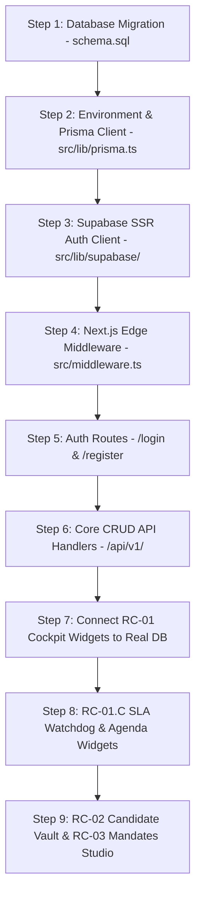

# RecruitOS - Foundation Readiness Audit & Dependency Roadmap

**Audit Date**: August 27, 2026  
**Audited Target**: Full RecruitOS Codebase, Specifications, and Data Schemas  
**Purpose**: Evaluate platform readiness, identify critical blockers, construct an architectural dependency graph, and recommend the exact next implementation phase.

---

## 1. Audit Findings: Implementation vs. Specification Matrix

### 1.1 What is Already Implemented in Actual Code?
- **Next.js 14 App Router Shell**: `src/app/layout.tsx`, `src/app/(dashboard)/layout.tsx`, `src/app/page.tsx`, `src/app/(dashboard)/cockpit/page.tsx`.
- **UI Design System Components**: `DashboardShell`, `Sidebar` (with RBAC route filtering), `TopNav`, `TenantBadge`, `UserProfileDropdown`.
- **Phase RC-01.B Cockpit UI Widgets**: `KpiMetricStrip` (5 KPI cards), `MandateCard` (stage progress bar), `MandatesGridControl` (search & filter tabs).
- **TypeScript Data Definitions**: `src/types/dashboard.ts`, `src/types/cockpit.ts`.
- **Build & Styling Infrastructure**: `package.json`, `tsconfig.json`, `tailwind.config.js`, `postcss.config.js`, `next.config.mjs`, `globals.css`.

### 1.2 What Exists Only as Documentation / Specification?
- **PostgreSQL DDL & RLS Engine**: `schema.sql` (43 tables, RLS policies, trigger functions).
- **Prisma Data Models**: `schema.prisma` (43 Prisma models, ENUM mappings, index attributes).
- **Supabase Infrastructure Specification**: `supabase_setup_specification.md` (Storage buckets, JWT claim hooks, `pg_cron` jobs).
- **Security & Authentication Specifications**: `authentication_foundation_specification.md`, `authorization_matrix.md`.
- **Environment Reference**: `environment_variables_reference.md`.

---

## 2. Critical Blockers to Functional Application Readiness

Before RecruitOS can perform real recruiting operations, five core foundation blockers must be resolved:

```
┌────────────────────────────────────────────────────────────────────────────────────────┐
│                                BLOCKER MATRIX                                          │
├───────────────────────────────┬────────────────────────────────────────────────────────┤
│ Blocker 1: Database Instance  │ `schema.sql` not migrated to a live Supabase DB.       │
│ Blocker 2: Prisma Client      │ Missing `src/lib/prisma.ts` singleton DB client.       │
│ Blocker 3: Supabase Auth Client│ Missing `src/lib/supabase/server.ts` SSR helper.      │
│ Blocker 4: Edge Middleware    │ Missing `src/middleware.ts` for tenant subdomain check.│
│ Blocker 5: Authentication App │ Missing `/login` page and session authentication.     │
└───────────────────────────────┴────────────────────────────────────────────────────────┘
```

---

## 3. Architecture Dependency Graph & Build Order



---

## 4. Priority Analysis: Critical Dependencies vs. Postponable Modules

### 4.1 Critical Dependencies (MUST Build Next)
1. **Live Database Migration & Environment Variables**: Essential for persistent data storage.
2. **Prisma & Supabase Client Utilities**: Required for server components and API route handlers to query the database safely.
3. **Next.js Multi-Tenant Edge Middleware**: Essential for enforcing tenant subdomain isolation (`apex.recruitos.com`) and verifying JWT claims.
4. **Authentication & Session Routes**: Required to resolve active user identity dynamically without hardcoded mocks.

### 4.2 Postponable Modules (Can be Built Later)
- **RC-08 Finance & Invoicing Module**: Invoices and split fee ledgers can be implemented after recruitment pipeline operations.
- **WhatsApp WABA Integration**: Automated WhatsApp messaging can be built after core candidate intake.
- **Resume Parser LLM Edge Function**: Automated AI parsing can follow standard CV file uploads.
- **Custom White-Label SSL Binding**: Subdomain routing works locally and in staging prior to custom SSL certificates.

---

## 5. Final Architectural Recommendation

### Recommendation: **Option B — Core Platform Foundation**

### Rationale & Architectural Justification

1. **Avoid Mock Telemetry Accumulation**: Implementing RC-01.C dashboard widgets right now would add more UI components operating on mock data without real data persistence or multi-tenant database isolation.
2. **Data Pipeline First**: Establishing the **Core Platform Foundation** (Database Migration, Prisma Client Helper, Supabase SSR Integration, and Next.js Edge Middleware) creates the real database connection layer.
3. **Seamless Dashboard Wiring**: Once Option B is completed, RC-01.C widgets (SLA Watchdog and Today's Agenda) and existing RC-01.B cards can immediately consume real, RLS-protected database data from Prisma.
