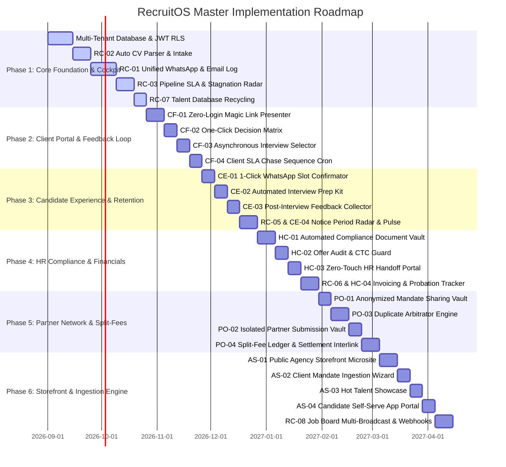

# RecruitOS - Master Implementation Plan

## Architectural Overview & Multi-Tenant Foundation

RecruitOS is an operational operating system engineered for independent recruiters and agency founders. It transitions traditional recruitment from a static "data graveyard" to an active radar system with strict SLA enforcement, automated multi-channel communications, zero-login portals, and split-fee partner collaboration.

### Core Multi-Tenancy Architecture
- **Tenant Identification**: Every request and database record is explicitly scoped to a single `agency_id` (Tenant ID).
- **JWT Context Middleware**: Next.js API Middleware extracts `agency_id` from secure HttpOnly JWT cookies, attaching it to the request context (`req.agency_id`).
- **PostgreSQL Row-Level Security (RLS)**: Enforced via `RESTRICTIVE` RLS policies across core entity tables using `app.current_agency_id` session parameters:
  ```sql
  ALTER TABLE candidate_records ENABLE ROW LEVEL SECURITY;
  ALTER TABLE job_mandates ENABLE ROW LEVEL SECURITY;
  ALTER TABLE candidate_submissions ENABLE ROW LEVEL SECURITY;

  CREATE POLICY tenant_isolation_policy ON candidate_records AS RESTRICTIVE
    USING (agency_id = NULLIF(current_setting('app.current_agency_id', true), '')::UUID);
  ```

---

## 1. System User Roles

1. **Agency Founder / Independent Recruiter**: Full administrative control over agency settings, mandates, candidates, financial billing, SLA radars, partner network sharing, and storefront configurations.
2. **Client Hiring Manager / Interviewer**: Zero-login access via magic link to review candidate shortlists, execute 1-click decisions with structured rejection feedback, and propose interview availability slots.
3. **Candidate / Offered Candidate**: Zero-login mobile hub access for confirming interview slots, viewing interview prep kits, submitting post-interview debriefs, completing bi-weekly notice-period pulse checks, and uploading compliance documents.
4. **Client HR & Finance Specialist**: Zero-login access to onboarding compliance vaults, 1-click ZIP package downloads, candidate joining confirmation, and invoice settlement processing.
5. **Partner Recruiter / Freelance Sourcer**: Anonymized access to shared mandates, isolated candidate ingestion workspace, first-touch duplicate arbitration tracking, and split-fee commission ledger views.
6. **Public Storefront Visitor / Prospective Client**: Public web user interacting with agency storefront microsite, submitting self-serve job orders, requesting hot talent teasers, or submitting direct resume applications.

---

## 2. Database Domains

1. **Tenant & Agency Management Domain**: `agencies`, `agency_users`, `agency_job_board_credentials`, `agency_storefront_profiles`.
2. **Mandate & Job Order Domain**: `job_mandates`, `inbound_client_mandates`, `job_board_postings`, `job_prep_kits`.
3. **Candidate & Parsing Domain**: `candidate_records`, `candidate_documents`, `candidate_relationships`, `storefront_talent_showcases`, `storefront_candidate_applications`.
4. **Pipeline & Submissions Domain**: `candidate_submissions`, `pipeline_sla_logs`, `client_decision_enum`, `rejection_reason_enum`.
5. **Portals & Access Tokens Domain**: `client_portal_tokens`, `client_sla_reminders`, `client_hr_handoffs`.
6. **Interview & Scheduling Domain**: `proposed_interview_slots`, `interview_schedules`, `candidate_prep_logs`, `candidate_interview_feedback`.
7. **Notice Period & Retention Domain**: `notice_period_trackers`, `notice_period_pulse_responses`, `probation_guarantee_trackers`.
8. **Financials & Settlements Domain**: `job_offer_audits`, `invoice_records`, `offer_audit_logs`.
9. **Partner & Collaboration Domain**: `partner_mandate_shares`, `partner_candidate_submissions`, `candidate_ownership_arbitrations`, `partner_split_ledgers`.

---

## 3. Required Background Jobs

1. **Client SLA Chase Worker** (`Node-Cron / BullMQ` - Every 1 hour): Scans active `client_portal_tokens` for unreviewed candidate batches. Triggers soft WhatsApp nudges at 24h, SLA alert emails at 48h, and Cockpit red alerts at 72h (respecting DND hours 8 PM – 9 AM local time).
2. **Notice Period Cadence Dispatcher** (`Daily Cron`): Generates and dispatches automated WhatsApp pulse check pings for offered candidates on Days 7, 15, 30, 45, and 60 of notice periods.
3. **Interview Prep Kit Dispatcher** (`Cron` - Every 15 mins): Checks `interview_schedules` starting in T-24 hours; dispatches WhatsApp prep kit links to candidates; triggers T-4h unacknowledged alerts.
4. **Post-Interview Debrief Trigger** (`Cron` - Every 15 mins): Dispatches automated WhatsApp feedback survey link to candidate 15 minutes post-interview end time (`T+15m`).
5. **90-Day Probation Guarantee Monitor** (`Daily Cron` at Midnight): Progresses daily counter on `probation_guarantee_trackers`; updates status to `Completed` on Day 90; surfaces Day 80 expiry alerts; triggers replacement mandate creation on early quit.
6. **Job Board Ingestion Webhook Receiver & Async Parser**: Process incoming candidate webhooks from Naukri, Bayt, LinkedIn; streams attached resumes to S3 and enqueues parsing tasks.
7. **Duplicate Arbitration Engine** (<200ms Async Worker): Validates incoming candidate submissions against duplicate rules (90-day active pipeline block, 180-day stale lead reactivation, partner vs partner first-touch attribution).

---

## 4. Required External Integrations

1. **WhatsApp Business API (WABA / Twilio / Meta Webhooks)**: Outbound template dispatch, inbound chat receipt, 2-way communication log, automated candidate/client nudges.
2. **Email Services (IMAP / SMTP / SendGrid / Resend)**: Communication sync, client review email alerts, formal invoice dispatch, client HR onboarding link delivery.
3. **Cloud Storage (AWS S3 / Supabase Storage)**: Secure candidate CV storage, sanitized document generation, private signed URL streaming for compliance files (IDs, pay slips, signed offer letters), voice debrief clips.
4. **Video Conferencing APIs (Google Meet / Zoom API)**: Dynamic meeting room URL generation upon candidate interview slot confirmation.
5. **External Job Board APIs (Naukri, Bayt, LinkedIn Jobs APIs & Webhooks)**: One-click job mandate multi-broadcasting and real-time application webhook ingestion.
6. **Bot & Security Verification (Google Cloud reCAPTCHA v3 & Rate Limiters)**: Public storefront endpoint abuse prevention, DDoS protection, file magic-number malware scanning.

---

## 5. Comprehensive Zone & Feature Breakdowns

### ZONE 1: THE RECRUITER COCKPIT (Internal Command Center & SLA Radar)

#### Feature RC-01: Unified WhatsApp & Email Communication Log
- **What it does**: Centralizes all candidate/client interaction timelines into a single Cockpit drawer. 2-way sync via WABA and IMAP/SMTP. Auto-matches incoming messages by Phone then Email, tags unlinked leads, parses negative sentiment/keywords ("counter offer", "resigned") to display High-Risk badges on pipeline cards. Offers 1-click WhatsApp messaging templates.
- **Database Tables**: `candidate_records`, `communication_logs`, `agency_templates`, `agencies`.
- **Required APIs**:
  - `GET /api/v1/cockpit/communications` (Fetch live stream)
  - `POST /api/v1/cockpit/communications/send` (Dispatch message/template)
  - `POST /api/v1/webhooks/whatsapp` (Inbound WABA webhook)
  - `POST /api/v1/webhooks/email` (Inbound IMAP/SMTP webhook)
- **Features Depending On It**: RC-03, RC-05, CE-01, CE-02, CE-03, CE-04, CF-04.

#### Feature RC-02: Automated Intake & Clean CV Parsing Engine
- **What it does**: Accepts drag-and-drop raw CV files (PDF, DOCX, RTF). Uses LLM/regex entity extraction to parse name, skills, total experience, notice period, and CTC details. Performs duplicate check, renames files in S3 under standardized naming, and outputs a client-ready sanitized summary view (stripping personal contact info).
- **Database Tables**: `candidate_records`, `candidate_documents`.
- **Required APIs**:
  - `POST /api/v1/candidates/parse-cv` (Upload & parse binary)
  - `POST /api/v1/candidates/confirm-intake` (Save parsed candidate)
  - `GET /api/v1/candidates/:id/sanitized` (Get client-ready profile)
- **Features Depending On It**: RC-07, PO-02, AS-04, RC-08.

#### Feature RC-03: Pipeline SLA & Stagnation Aging Radar
- **What it does**: Tracks stage SLAs (Screened→Submitted <24h, Submitted→Feedback <48h alert / 72h breach, Interview→Decision <24h). Sorts column cards by time in stage, displays yellow timer badges or red glowing breach alerts, and enables 1-click automated client chase triggers.
- **Database Tables**: `candidate_submissions`, `job_mandates`, `pipeline_sla_logs`.
- **Required APIs**:
  - `GET /api/v1/cockpit/sla-radar` (Fetch SLA metrics & stalled candidates)
  - `POST /api/v1/submissions/:id/chase-client` (Manual trigger for client nudge)
- **Features Depending On It**: CF-04.

#### Feature RC-04: Relational Talent & Household Mapping
- **What it does**: Links candidate profiles by relationship types (Spouse, Referral, Ex-Colleague). When Candidate A shifts to "Offer Accepted" in Location X, auto-updates Candidate B's target location to X and sets availability status to "Hot Lead", surfacing Candidate B when relevant open roles appear.
- **Database Tables**: `candidate_relationships`, `candidate_records`, `job_mandates`.
- **Required APIs**:
  - `POST /api/v1/candidates/relationships` (Create candidate connection)
  - `GET /api/v1/candidates/:id/network` (Fetch connected candidates)
- **Features Depending On It**: RC-07.

#### Feature RC-05: Post-Offer 90-Day Drop-Off Radar
- **What it does**: Enforces a 60 to 90-day engagement matrix between offer acceptance and Day 1 joining (Day 7 pulse, Day 20 document proof, Day 35 check-in, Day 50 prep). Evaluates risk levels (Low/Med/High). Raises critical alerts in Cockpit if candidate goes unread or dark for 72h.
- **Database Tables**: `notice_period_trackers`, `notice_period_pulse_responses`, `candidate_submissions`.
- **Required APIs**:
  - `GET /api/v1/cockpit/notice-radar` (Fetch notice period pipeline)
  - `POST /api/v1/notice-period/:id/trigger-call` (Log emergency intervention)
- **Features Depending On It**: CE-04, HC-02, HC-04.

#### Feature RC-06: Lifecycle-Triggered Settlement & Invoicing Engine
- **What it does**: Auto-calculates placement fees based on client contract terms (Fixed CTC percentage, retainer + success fee). Auto-generates draft invoices on candidate Day 1 joining or probation milestones. Tracks probation guarantee replacement windows.
- **Database Tables**: `invoice_records`, `job_offer_audits`, `candidate_submissions`, `agencies`.
- **Required APIs**:
  - `GET /api/v1/financials/invoices` (List agency invoices)
  - `POST /api/v1/financials/invoices/:id/approve-dispatch` (Approve & email client invoice)
- **Features Depending On It**: HC-02, HC-03, PO-04.

#### Feature RC-07: Talent Database Recycling Engine ("Silver Medalist" Indexer)
- **What it does**: On new job mandate creation, automatically searches historical candidate database for high-performing candidates from past mandates who reached interview rounds but were rejected for non-skill reasons (e.g., budget mismatch, second choice). Displays instant shortlist drawer for 1-click WhatsApp re-engagement.
- **Database Tables**: `candidate_records`, `candidate_submissions`, `job_mandates`.
- **Required APIs**:
  - `GET /api/v1/jobs/:id/silver-medalists` (Fetch past interviewed matches)
  - `POST /api/v1/candidates/re-engage` (Dispatch re-engagement WhatsApp)
- **Features Depending On It**: AS-03.

#### Feature RC-08: Job Board One-Click Multi-Posting & Ingestion Engine
- **What it does**: One-click broadcast of job mandates to Naukri, Bayt, and LinkedIn Jobs APIs. Listens to application webhooks, auto-parses candidate CVs, executes duplicate checks, and imports candidates into pipeline tagged with source.
- **Database Tables**: `agency_job_board_credentials`, `job_board_postings`, `candidate_records`, `candidate_submissions`.
- **Required APIs**:
  - `POST /api/v1/jobs/:job_id/broadcast` (Publish mandate across portals)
  - `POST /api/v1/webhooks/job-boards/:board_name` (Webhook receiver endpoint)
  - `GET /api/v1/integrations/job-boards` (Manage board API credentials)
- **Features Depending On It**: RC-02, PO-03.

---

### ZONE 2: THE CLIENT & INTERVIEWER PORTAL (The Feedback Engine)

#### Feature CF-01: Zero-Login Magic Link Candidate Presenter
- **What it does**: Generates secure 128-bit encrypted SHA-256 token URLs. Allows hiring managers to view candidate shortlists and sanitized CVs directly on desktop/mobile without password login. 14-day token expiration with audit logging.
- **Database Tables**: `client_portal_tokens`, `job_mandates`, `candidate_submissions`, `candidate_records`.
- **Required APIs**:
  - `POST /api/v1/jobs/:id/generate-client-link` (Generate portal token)
  - `GET /api/v1/public/portal/:token` (Fetch candidate shortlist payload)
- **Features Depending On It**: CF-02, CF-03, CF-04.

#### Feature CF-02: One-Click Candidate Decision & Feedback Matrix
- **What it does**: Provides instant action buttons (`[Shortlist]`, `[Reject]`, `[Hold]`) on client portal candidate cards. Enforces structured rejection reasons (`Over Budget`, `Technical Skill Gap`, `Notice Period`, `Culture Fit`) with optional notes. Syncs decision instantly to Cockpit and resets SLA timers.
- **Database Tables**: `candidate_submissions`, `client_portal_tokens`.
- **Required APIs**:
  - `POST /api/v1/public/portal/:token/submissions/:submission_id/decision` (Submit decision)
- **Features Depending On It**: CF-03, RC-03.

#### Feature CF-03: Asynchronous Interview Slot Selector
- **What it does**: When client clicks `[Shortlist]`, surfaces a 7-day mini calendar picker. Client selects 2-3 interview slots and enters interviewer details. Automatically routes slot options to candidate via WhatsApp.
- **Database Tables**: `proposed_interview_slots`, `candidate_submissions`, `client_portal_tokens`.
- **Required APIs**:
  - `POST /api/v1/public/portal/:token/submissions/:submission_id/slots` (Submit proposed slots)
- **Features Depending On It**: CE-01.

#### Feature CF-04: Automated Client Chase Sequence & SLA Escalation
- **What it does**: Hourly background cron worker tracks client review time. Dispatches soft WhatsApp reminder at 24h, SLA alert email at 48h, and Cockpit red breach glow at 72h. Enforces DND window (8 PM - 9 AM) and auto-pauses when client acts.
- **Database Tables**: `client_sla_reminders`, `client_portal_tokens`, `candidate_submissions`.
- **Required APIs**:
  - Hourly Cron Worker Execution (`0 * * * *`)
  - `GET /api/v1/cockpit/client-reminders-log` (Audit trail of client nudges)
- **Features Depending On It**: RC-03.

---

### ZONE 3: THE CANDIDATE EXPERIENCE HUB (The Engagement Loop & Prep)

#### Feature CE-01: 1-Click WhatsApp Slot Confirmator
- **What it does**: Candidate taps WhatsApp magic link, views proposed slots converted to local timezone, and selects 1 slot with a single tap. System creates Google Meet/Zoom room, generates calendar invite (.ics / Google Calendar), updates stage to "Interview Scheduled", and alerts client & recruiter.
- **Database Tables**: `interview_schedules`, `proposed_interview_slots`, `candidate_submissions`.
- **Required APIs**:
  - `GET /api/v1/public/candidate/slots/:token` (View slots)
  - `POST /api/v1/public/candidate/confirm-slot` (Lock slot & generate calendar link)
- **Features Depending On It**: CE-02, CE-03.

#### Feature CE-02: Automated "Interview Prep Kit" Trigger
- **What it does**: Automatically dispatches interactive interview prep kit link to candidate 24 hours prior to scheduled interview. Mobile view features countdown timer, company tech stack details, interviewer LinkedIn profile, and behavioral response guides (e.g. Orange Test framework). Candidate clicks "I'm Ready", signaling Cockpit. Alerts at T-4h if unacknowledged.
- **Database Tables**: `job_prep_kits`, `candidate_prep_logs`, `interview_schedules`.
- **Required APIs**:
  - `GET /api/v1/public/candidate/prep-kit/:token` (Fetch prep content)
  - `POST /api/v1/public/candidate/prep-kit/:token/acknowledge` (Mark candidate prepped)
- **Features Depending On It**: RC-01.

#### Feature CE-03: Post-Interview Candidate Feedback Collector
- **What it does**: Dispatches automated WhatsApp debrief survey 15 minutes post-interview (`T+15m`). Candidate submits 1-5 star rating, interest level selection (`Excited`, `Doubts`, `Not Interested`), and text notes or 30-second audio clip via MediaRecorder API. Flags low interest for urgent recruiter intervention.
- **Database Tables**: `candidate_interview_feedback`, `interview_schedules`, `candidate_submissions`.
- **Required APIs**:
  - `POST /api/v1/public/candidate/interview-feedback` (Submit debrief payload)
  - `POST /api/v1/public/candidate/upload-voice-debrief` (Upload voice clip)
- **Features Depending On It**: RC-01.

#### Feature CE-04: Passive Notice-Period Pulse & Counter-Offer Radar
- **What it does**: Executes bi-weekly automated WhatsApp pulse checks across 30-90 day notice periods (Days 7, 15, 30, 45, 60). Captures counter-offer status and handover progress. Prompts resignation acceptance upload on Day 15. Calculates risk level (Low, Med, High) and updates Cockpit Notice Period Radar (RC-05).
- **Database Tables**: `notice_period_pulse_responses`, `notice_period_trackers`, `candidate_records`.
- **Required APIs**:
  - `POST /api/v1/public/candidate/notice-pulse` (Submit pulse survey response)
  - `POST /api/v1/public/candidate/upload-resignation-proof` (Upload resignation proof file)
- **Features Depending On It**: RC-05.

---

### ZONE 4: THE HR & COMPLIANCE ZONE (Post-Offer Handoff)

#### Feature HC-01: Automated Compliance Document Vault
- **What it does**: Dispatches onboarding document checklist link to candidate upon reaching "Offer Accepted". Candidate uploads National ID, PAN, Pay Slips, Relieving Letter, Degree, and Signed Offer. Auto-validates file sizes/formats, stores files in private S3 bucket with temporary signed URLs, and updates Cockpit vault progress bar (e.g. 80%). Rejection by HR triggers specific WhatsApp re-upload nudge.
- **Database Tables**: `candidate_compliance_docs`, `candidate_submissions`, `candidate_records`.
- **Required APIs**:
  - `GET /api/v1/public/candidate/compliance-status/:token` (Get document checklist)
  - `POST /api/v1/public/candidate/compliance-doc` (Upload document binary)
  - `POST /api/v1/hr/reject-doc` (HR rejects specific doc with reason)
- **Features Depending On It**: HC-03.

#### Feature HC-02: Offer Audit & CTC Verification Engine
- **What it does**: Form drawer to record offered fixed CTC, variable CTC, joining date, and upload signed offer letter. Auto-calculates placement fee based on client percentage terms. Triggers CTC variance warning if offered CTC is >10% below expected CTC. Auto-populates draft placement invoice in RC-06. Appends audit log for post-submit CTC edits.
- **Database Tables**: `job_offer_audits`, `candidate_submissions`, `offer_audit_logs`, `invoice_records`.
- **Required APIs**:
  - `POST /api/v1/offers/audit` (Create offer audit record)
  - `GET /api/v1/offers/audit/:submission_id` (Fetch offer audit details)
- **Features Depending On It**: RC-06, HC-03, PO-04.

#### Feature HC-03: Zero-Touch Client HR Handoff Portal
- **What it does**: On candidate joining date, dispatches magic link to Client HR. HR views onboarding vault, streams 1-click complete ZIP package of compliance documents, and clicks `[Confirm Candidate Joined Successfully]`. Automatically shifts candidate to "Joined" in Cockpit, dispatches invoice in RC-06, and starts 90-day probation clock (HC-04).
- **Database Tables**: `client_hr_handoffs`, `candidate_submissions`, `candidate_compliance_docs`.
- **Required APIs**:
  - `GET /api/v1/public/hr-portal/:token/download-zip` (Stream compliance files zip)
  - `POST /api/v1/public/hr-portal/:token/confirm-joining` (Confirm joining & trigger lifecycle events)
- **Features Depending On It**: RC-06, HC-04, PO-04.

#### Feature HC-04: Probation Guarantee Clock & Milestone Tracker
- **What it does**: Activates 90-day countdown bar on candidate joining. Schedules automated Day 30 and Day 60 health check milestones. Alerts recruiter at Day 80. Shifts status to "Guarantee Fulfilled" on Day 90. If candidate quits early, logs breach, tags invoice as "Guarantee Credit Pending", and creates a `[REPLACEMENT MANDATE]` in Cockpit.
- **Database Tables**: `probation_guarantee_trackers`, `candidate_submissions`, `job_mandates`.
- **Required APIs**:
  - Daily Cron Worker (`0 0 * * *`)
  - `POST /api/v1/probation/breach` (Log candidate resignation during probation)
  - `POST /api/v1/probation/milestone-check` (Log manual probation check-in)
- **Features Depending On It**: RC-06, PO-04.

---

### ZONE 5: THE PARTNER & VENDOR COLLABORATION NETWORK (Split-Fee Management)

#### Feature PO-01: Anonymized Mandate Sharing & Client Masking Vault
- **What it does**: Enables recruiters to share job mandates with freelance sourcers/partner agencies without exposing client identity. Auto-masks client name, CTC range, and strips URLs/emails/phone numbers via regex. Dispatches encrypted magic link displaying masked mandate specs and split agreement terms (e.g. 50/50).
- **Database Tables**: `partner_mandate_shares`, `job_mandates`, `agencies`.
- **Required APIs**:
  - `POST /api/v1/jobs/:job_id/partner-share` (Create partner share link)
  - `GET /api/v1/public/partner/:token` (Fetch masked mandate details)
- **Features Depending On It**: PO-02, PO-03, PO-04.

#### Feature PO-02: Isolated Partner Submission Vault
- **What it does**: Provides partners a dedicated zero-login workspace to submit candidate details and CVs. Runs immediate duplicate check (PO-03). Partner view displays a restricted table containing ONLY candidates submitted by their partner email. Cockpit displays incoming partner candidate with a distinct purple `[PARTNER]` badge.
- **Database Tables**: `partner_candidate_submissions`, `candidate_submissions`, `candidate_records`.
- **Required APIs**:
  - `POST /api/v1/public/partner/:token/submissions` (Upload partner candidate)
  - `GET /api/v1/public/partner/:token/my-submissions` (List partner's submitted candidates)
- **Features Depending On It**: PO-03, PO-04.

#### Feature PO-03: Automated Candidate Ownership & Duplicate Arbitrator
- **What it does**: High-performance (<200ms) background arbitration service evaluating duplicate ownership: Rule 1 (Active in-house client pipeline <90d → Blocked), Rule 2 (Stale in-house database >180d → Approved with 50% split), Rule 3 (Partner vs Partner → First touch timestamp wins). Normalizes phone/email before matching; records timestamped audit log.
- **Database Tables**: `candidate_ownership_arbitrations`, `candidate_submissions`, `candidate_records`.
- **Required APIs**:
  - Internal Service: `arbitrateCandidateOwnership(jobId, email, phone, shareId)`
  - `GET /api/v1/partner/arbitration-log/:job_id` (View arbitration audit history)
- **Features Depending On It**: PO-02, RC-08, AS-04.

#### Feature PO-04: Split-Fee Ledger & Auto-Settlement Interlink
- **What it does**: Triggered when Client HR confirms joining (HC-03). Reads calculated fee from HC-02 and split percentage from PO-01. Auto-generates Client Receivables Invoice and Partner Payable Voucher. Updates partner dashboard status ("Awaiting Client Payment" → "Ready for Payout"). Freezes payout if candidate quits during probation (HC-04).
- **Database Tables**: `partner_split_ledgers`, `partner_mandate_shares`, `candidate_submissions`.
- **Required APIs**:
  - `GET /api/v1/public/partner/:token/ledger` (View partner commission earnings)
  - `POST /api/v1/financials/partner-payout/:ledger_id/mark-paid` (Record payout completion)
- **Features Depending On It**: HC-03, HC-04, RC-06.

---

### ZONE 6: THE AGENCY STOREFRONT (Inbound Lead Generation)

#### Feature AS-01: Public Agency Storefront & Branded Engine
- **What it does**: Provisioning engine generating a public agency microsite on subdomain or custom domain (`agency.recruiteros.com`). Renders agency logo, founder bio, specializations, verified placement metrics, and CTAs for clients & candidates. Managed via Cockpit settings. Sanitized against XSS.
- **Database Tables**: `agency_storefront_profiles`, `agencies`, `job_mandates`.
- **Required APIs**:
  - `GET /api/v1/public/storefront/:subdomain` (Fetch storefront profile & stats)
  - `PUT /api/v1/agency/storefront-settings` (Update branding & content from Cockpit)
- **Features Depending On It**: AS-02, AS-03, AS-04.

#### Feature AS-02: Self-Serve Client Mandate Ingestion Engine ("Swiggy-Style" Job Order Intake)
- **What it does**: Interactive 4-step wizard (Company Details, Role Specifications, Term Selection like Contingency vs Retainer, JD Attachment). Submitting creates an unassigned job mandate in Cockpit with alert badge `[NEW INBOUND CLIENT MANDATE]`. Enforces reCAPTCHA v3 & IP rate limiting.
- **Database Tables**: `inbound_client_mandates`, `job_mandates`, `clients`.
- **Required APIs**:
  - `POST /api/v1/public/storefront/:subdomain/submit-mandate` (Submit client mandate order)
- **Features Depending On It**: RC-01.

#### Feature AS-03: "Hot Talent Showcase" & Candidate Teaser Gallery
- **What it does**: Recruiter toggles "Feature on Storefront" for top pre-vetted silver medalists (RC-07). Auto-sanitizes candidate details into a public teaser card (headline, experience, notice period, skills, summary). Prospective employers click "Request Candidate Profile", creating an inbound client lead in Cockpit.
- **Database Tables**: `storefront_talent_showcases`, `candidate_records`, `inbound_client_mandates`.
- **Required APIs**:
  - `GET /api/v1/public/storefront/:subdomain/talent` (Fetch active talent teasers)
  - `POST /api/v1/public/storefront/:subdomain/request-talent` (Submit employer talent request)
- **Features Depending On It**: RC-07.

#### Feature AS-04: Candidate Self-Serve Application Portal
- **What it does**: Public "Join Talent Network / Drop Resume" modal on storefront. Candidate submits details and drops CV file. Auto-parses CV (RC-02 logic), runs duplicate arbitration (PO-03), creates candidate record, tags source `Storefront_Direct`, and surfaces candidate in Cockpit inbound queue. Enforces binary file magic number virus scanning.
- **Database Tables**: `storefront_candidate_applications`, `candidate_records`.
- **Required APIs**:
  - `POST /api/v1/public/storefront/:subdomain/apply` (Submit resume application)
- **Features Depending On It**: RC-02, PO-03.

---

## 6. Recommended Build Order & Phased Roadmap



### Phase Summary Roadmap

#### Phase 1: Core Tenant Infrastructure, Baseline Cockpit & Candidate Processing
- Multi-Tenant Schema Setup, JWT Context Middleware, PostgreSQL Row-Level Security (RLS).
- **RC-02**: Automated Intake & CV Parsing Engine (S3 Storage, LLM entity extraction).
- **RC-01**: Unified WhatsApp & Email Communication Log (WABA / SMTP webhooks).
- **RC-03**: Pipeline SLA & Stagnation Aging Radar (Kanban aging logic).
- **RC-07**: Talent Database Recycling Engine ("Silver Medalist" Indexer).

#### Phase 2: Client Portal & Feedback Automation
- **CF-01**: Zero-Login Magic Link Candidate Presenter (SHA-256 token link).
- **CF-02**: One-Click Decision & Rejection Reason Matrix.
- **CF-03**: Asynchronous Interview Slot Selector (7-day calendar picker).
- **CF-04**: Automated Client SLA Chase Sequence (Background Cron worker).

#### Phase 3: Candidate Experience & Notice-Period Retention Loop
- **CE-01**: 1-Click WhatsApp Slot Confirmator (Google Meet / Zoom API integration).
- **CE-02**: Automated Interview Prep Kit Trigger (T-24h prep page).
- **CE-03**: Post-Interview Candidate Feedback Collector (T+15m survey & voice clip).
- **RC-05 & CE-04**: 90-Day Post-Offer Drop-Off Radar & Bi-Weekly Notice Period Pulse Checks.

#### Phase 4: HR Compliance, Placement Auditing & Settlement Engine
- **HC-01**: Automated Compliance Document Vault (Private S3 buckets, signed URLs).
- **HC-02**: Offer Audit & CTC Verification Engine (Fee calculator & variance warning).
- **HC-03**: Zero-Touch Client HR Handoff Portal (1-click ZIP package streaming).
- **RC-06 & HC-04**: Lifecycle Invoicing Engine & 90-Day Probation Guarantee Clock.

#### Phase 5: Partner & Vendor Collaboration Network (Split-Fee Management)
- **PO-01**: Anonymized Mandate Sharing & Client Masking Vault.
- **PO-03**: Automated Candidate Ownership & Duplicate Arbitrator (<200ms arbitration rule engine).
- **PO-02**: Isolated Partner Submission Vault.
- **PO-04**: Split-Fee Ledger & Auto-Settlement Interlink.

#### Phase 6: Agency Storefront, Job Board Syndication & Inbound Growth Engine
- **AS-01**: Public Agency Storefront & Branded Engine (Subdomain/custom domain microsite).
- **AS-02**: Self-Serve Client Mandate Ingestion Engine ("Swiggy-Style" 4-step wizard).
- **AS-03**: "Hot Talent Showcase" & Candidate Teaser Gallery.
- **AS-04**: Candidate Self-Serve Application Portal.
- **RC-08**: Job Board One-Click Multi-Posting & Webhook Ingestion Engine (Naukri, Bayt, LinkedIn).
