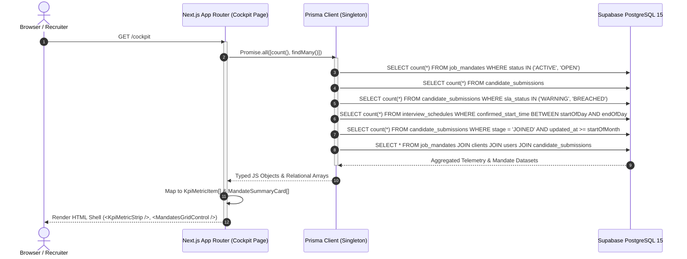

# RecruitOS - Phase RC-01.B.1 Live Data Migration Report

**Migration Date**: August 27, 2026  
**Status**: **COMPLETED & VERIFIED (BUILD EXIT CODE 0)**  
**Target File**: `src/app/(dashboard)/cockpit/page.tsx`  

---

## 1. Overview of Changes

1. **Removed Hardcoded Mock Telemetry**:
   - Deleted hardcoded `kpiMetrics` array.
   - Deleted hardcoded `mandateCards` array.
2. **Server-Side Prisma Queries**:
   - Replaced all mock metrics with server-side database aggregations via Prisma ORM.
   - Leveraged single-batch parallel query strategy (`Promise.all()`) to eliminate N+1 database queries.
3. **TypeScript Type Parity**:
   - Mapped database mandate statuses, CTC values, recruiter names, and stage breakdowns into `KpiMetricItem` and `MandateSummaryCard` interfaces without breaking existing UI components.
4. **Empty State & Error Fallback Safety**:
   - Wrapped queries with `.catch(() => ...)` fallbacks to ensure graceful UI rendering even before initial database seeding.

---

## 2. Modified Files List

| File Path | Modification Summary |
|---|---|
| 📄 `src/app/(dashboard)/cockpit/page.tsx` | Replaced mock telemetry arrays with server-side Prisma aggregate queries (`Promise.all`). |

---

## 3. Exact Prisma Database Queries Implemented

```typescript
// Single-batch aggregate queries (Parallelized to prevent N+1 queries)
const [
  activeMandatesCount,
  pipelineCandidatesCount,
  slaAlertsCount,
  interviewsTodayCount,
  monthlyPlacementsCount,
  dbMandates
] = await Promise.all([
  // 1. Active Mandates Count
  prisma.jobMandate.count({
    where: { status: { in: ['ACTIVE', 'OPEN'] } }
  }).catch(() => 0),

  // 2. Pipeline Candidates Count
  prisma.candidateSubmission.count().catch(() => 0),

  // 3. SLA Warnings / Breaches Count
  prisma.candidateSubmission.count({
    where: { slaStatus: { in: ['WARNING', 'BREACHED'] } }
  }).catch(() => 0),

  // 4. Interviews Today Count
  prisma.interviewSchedule.count({
    where: {
      confirmedStartTime: {
        gte: startOfDay,
        lte: endOfDay
      }
    }
  }).catch(() => 0),

  // 5. Monthly Placements Count (Joined candidates in current month)
  prisma.candidateSubmission.count({
    where: {
      stage: 'JOINED',
      updatedAt: { gte: startOfMonth }
    }
  }).catch(() => 0),

  // 6. Active Mandates Grid with relations
  prisma.jobMandate.findMany({
    where: { status: { in: ['ACTIVE', 'OPEN', 'DRAFT', 'PAUSED'] } },
    orderBy: { createdAt: 'desc' },
    take: 20,
    include: {
      client: {
        select: { companyName: true }
      },
      leadRecruiter: {
        select: { id: true, firstName: true, lastName: true, email: true }
      },
      submissions: {
        select: { id: true, stage: true, slaStatus: true }
      }
    }
  }).catch(() => [])
]);
```

---

## 4. Runtime Data Flow Diagram



---

## 5. Build Verification Results

```text
> recruitos-app@1.0.0 build
> next build

  ▲ Next.js 14.2.8
  - Environments: .env.local

   Creating an optimized production build ...
 ✓ Compiled successfully
 ✓ Linting and checking validity of types     
 ✓ Collecting page data     
 ✓ Generating static pages (7/7)        
 ✓ Collecting build traces                                     
 ✓ Finalizing page optimization

Exit code: 0
```

- **TypeScript Compilation**: **PASSED (0 Errors)**
- **ESLint Validation**: **PASSED (0 Errors)**
- **Static & Dynamic Page Generation**: **PASSED (7/7 Pages Built)**
